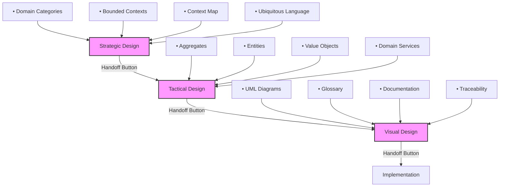

# Chatmodes Workflow - DDD Architecture

Diese Dokumentation beschreibt den strukturierten Workflow durch die DDD-Architecture Chatmodes mit integrierter Handoff-Logik.

## 📋 Übersicht

Der DDD-Architecture Workflow ist in drei aufeinanderfolgende Phasen unterteilt:




## 🔄 Handoff-Logik

### Was ist ein Handoff?

**Handoffs** sind interaktive Übergänge zwischen Chatmodes, die als Buttons nach einer abgeschlossenen Phase erscheinen. Sie ermöglichen:

- **Sequentielle Workflows**: Strukturierter Übergang von einer Phase zur nächsten
- **Kontextübertragung**: Relevante Dokumente und Informationen werden automatisch übergeben
- **Vorgefertigte Prompts**: Der nächste Chatmode startet mit einem spezifischen, vorausgefüllten Prompt

### Verfügbarkeit

⚠️ **Wichtig**: Handoffs sind aktuell nur in **VS Code Insiders** verfügbar.

- **VS Code Stable**: Handoffs werden ignoriert (Lint-Fehler), aber die Chatmodes funktionieren normal
- **VS Code Insiders**: Handoff-Buttons erscheinen nach jeder Phase

**Alternative**: In VS Code Stable verwenden Sie die expliziten Texthinweise am Ende jeder Phase:
```
➡️ Nächster Schritt: Fahren Sie mit dem Chatmode `xxx` fort...
```

## 📍 Phase 1: Strategic Design

**Chatmode**: `ddd-architect-strategic-design`

### Ziel
Die Geschäftsdomäne verstehen und in logische Bounded Contexts zerlegen.

### Schritte
1. **User Stories analysieren** → Nomen, Verben, Geschäftsregeln extrahieren
2. **Domänen kategorisieren** → Core Domain, Supporting, Generic Subdomain
3. **Bounded Contexts definieren** → Kontextgrenzen und Context Map erstellen

### Outputs
- `docs/architecture/ubiquitous-language_nomen&verben.md`
- `docs/architecture/domain-categorization.md`
- `docs/architecture/bounded-contexts-overview.md`

### Handoff zu Phase 2

```yaml
handoffs:
  - label: ➡️ Taktisches Design starten
    agent: ddd-architect-taktik-design
    prompt: |
      Die Bounded Contexts sind definiert. Beginne nun mit Phase 2: Taktisches Design.
      
      Analysiere die vorhandenen Dokumente:
      - docs/architecture/bounded-contexts-overview.md
      - docs/architecture/ubiquitous-language_nomen&verben.md
      - docs/architecture/domain-categorization.md
      
      Identifiziere für jeden Bounded Context die Aggregate, Entitäten und Value Objects.
    send: false
```

**Button-Label**: "➡️ Taktisches Design starten"  
**Ziel-Chatmode**: `ddd-architect-taktik-design`  
**Auto-Submit**: Nein (`send: false`) - Benutzer kann Prompt prüfen und anpassen

---

## 📍 Phase 2: Tactical Design

**Chatmode**: `ddd-architect-taktik-design`

### Ziel
Detailliertes Domain-Modell mit DDD-Bausteinen entwickeln.

### Schritte
1. **Aggregate identifizieren** → Aggregate Roots, Entities, Value Objects klassifizieren
2. **Attribute modellieren** → Detaillierte Eigenschaften und Beziehungen
3. **Methoden zuordnen** → Geschäftslogik den richtigen Aggregaten zuweisen
4. **Domain Services** → Services für aggregatübergreifende Logik
5. **Dokumentation** → Vollständige Dokumentation aller DDD-Bausteine

### Outputs
- `docs/architecture/aggregates-entities-valueobjects.md`

### Handoff zu Phase 3

```yaml
handoffs:
  - label: ➡️ Visualisierung starten
    agent: ddd-architect-visual-design
    prompt: |
      Die DDD-Bausteine sind definiert. Beginne nun mit Phase 3: Visualisierung und Dokumentation.
      
      Analysiere die vorhandenen Dokumente:
      - docs/architecture/aggregates-entities-valueobjects.md
      - docs/architecture/bounded-contexts-overview.md
      - docs/architecture/ubiquitous-language_nomen&verben.md
      
      Erstelle das vollständige Glossar und die PlantUML-Diagramme für alle Bounded Contexts.
    send: false
```

**Button-Label**: "➡️ Visualisierung starten"  
**Ziel-Chatmode**: `ddd-architect-visual-design`  
**Auto-Submit**: Nein (`send: false`)

---

## 📍 Phase 3: Visual Design

**Chatmode**: `ddd-architect-visual-design`

### Ziel
Vollständige Dokumentation und Visualisierung des Domain-Modells.

### Schritte
1. **Glossar erstellen** → Vollständiges Ubiquitous Language Glossar
2. **PlantUML-Diagramme** → Visuelle Darstellung pro Bounded Context
3. **Domain-Modell-Dokumentation** → Umfassende Gesamt-Dokumentation
4. **Traceability Matrix** → User Stories ↔ Aggregate Mapping

### Outputs
- `docs/architecture/ubiquitous-language-glossar.md`
- `docs/architecture/domain-models/*.domain-model.puml`
- `docs/architecture/domain-model.md`
- `docs/architecture/traceability-matrix.md`

### Handoff zu Implementation

```yaml
handoffs:
  - label: ➡️ Implementierung starten
    agent: sw-developer
    prompt: |
      Das Domain-Modell ist vollständig dokumentiert und visualisiert. Beginne nun mit der Implementierung.
      
      Analysiere die vorhandenen Dokumente:
      - docs/architecture/domain-model.md
      - docs/architecture/ubiquitous-language-glossar.md
      - docs/architecture/aggregates-entities-valueobjects.md
      - docs/architecture/traceability-matrix.md
      - docs/architecture/domain-models/*.puml
      
      Implementiere die Aggregate, Entitäten und Value Objects gemäß API-First DDD Workflow.
    send: false
```

**Button-Label**: "➡️ Implementierung starten"  
**Ziel-Chatmode**: `sw-developer`  
**Auto-Submit**: Nein (`send: false`)

---

## 🎯 Best Practices

### 1. Sequenziell arbeiten
Durchlaufen Sie die Phasen in der richtigen Reihenfolge:
```
Strategic Design → Tactical Design → Visual Design → Implementation
```

### 2. Dokumentation prüfen
Bevor Sie einen Handoff verwenden, prüfen Sie die erstellten Dokumente:
- Sind alle Bounded Contexts vollständig definiert?
- Sind die Aggregate korrekt identifiziert?
- Stimmt das Glossar?

### 3. Prompts anpassen
Die vorausgefüllten Prompts können angepasst werden:
- Fokussieren Sie auf spezifische Bounded Contexts
- Ergänzen Sie zusätzliche Anforderungen
- Verweisen Sie auf spezielle User Stories

### 4. Iterativ verfeinern
Der DDD-Prozess ist iterativ:
- Gehen Sie zurück zu früheren Phasen, wenn nötig
- Verfeinern Sie Bounded Contexts nach neuen Erkenntnissen
- Passen Sie Aggregate an, wenn sich Anforderungen ändern

## 🔧 Technische Details

### Handoff-Syntax (YAML Frontmatter)

```yaml
---
description: Kurze Beschreibung des Chatmodes
tools: ['edit', 'search', 'Ref/*', ...]
handoffs:
  - label: Button-Text
    agent: ziel-chatmode-name
    prompt: |
      Mehrzeiliger Prompt
      mit Kontext und Anweisungen
    send: false  # oder true für Auto-Submit
---
```

### Parameter

| Parameter | Typ | Beschreibung |
|-----------|-----|--------------|
| `label` | String | Text auf dem Handoff-Button (z.B. "➡️ Nächste Phase starten") |
| `agent` | String | Dateiname des Ziel-Chatmodes (ohne `.chatmode.md`) |
| `prompt` | String | Vorgefertigter Prompt für den Ziel-Chatmode (multiline mit `\|`) |
| `send` | Boolean | `true` = Auto-Submit, `false` = Prompt nur vorausfüllen (default) |

### Kompatibilität

| VS Code Version | Handoff Support | Workaround |
|-----------------|-----------------|------------|
| **Stable** | ❌ Nein | Texthinweise am Ende jeder Phase |
| **Insiders** | ✅ Ja | Handoff-Buttons erscheinen automatisch |

## 📚 Weitere Ressourcen

- [VS Code Custom Chat Modes Documentation](https://code.visualstudio.com/docs/copilot/customization/custom-chat-modes)
- [API-First DDD Guide](./development-workflow/api-first-ddd-guide.md)
- [DDD Best Practices](./.agent-resources/best-practices/)

---

**Letzte Aktualisierung**: 2025-11-12  
**VS Code Version**: 1.105+ (Handoffs in Insiders)  
**Status**: ✅ Implementiert
