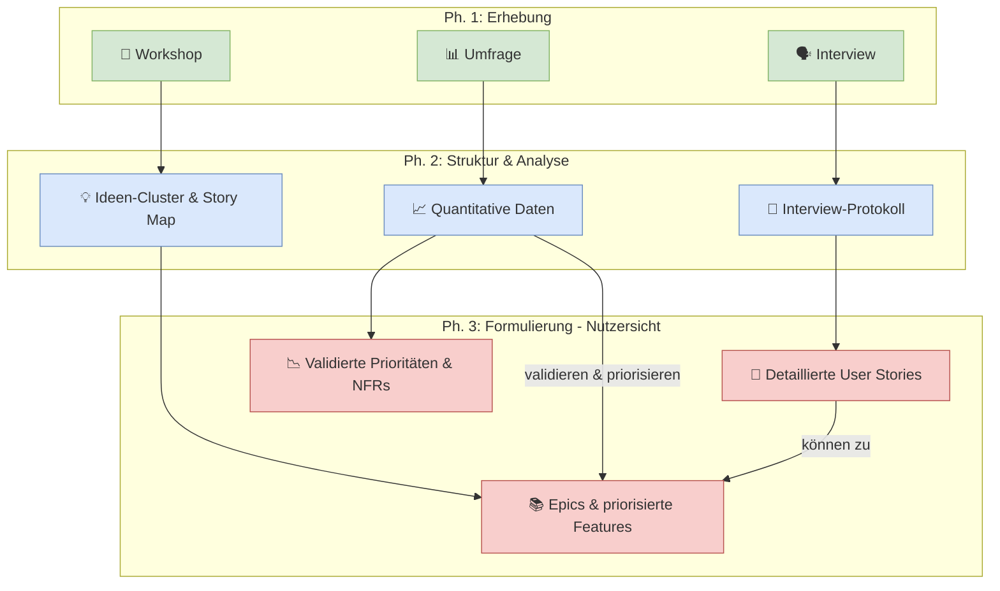

## 3.3. Von der Erhebung zur Anforderungsbeschreibung aus Benutzersicht

Stellen Sie sich vor, Sie sind ein Journalist, der viele Interviews geführt, an Pressekonferenzen teilgenommen und Notizen vor Ort gesammelt hat. Nun sitzen Sie vor einem Berg von Aufzeichnungen, Protokollen und losen Zetteln. Ihre Aufgabe ist es, aus diesem "rohen Material" einen strukturierten, verständlichen Artikel zu schreiben, der die wichtigsten Informationen klar und präzise vermittelt.

Genau das passiert auch im Requirements Engineering: Die erhobenen Informationen aus Interviews, Workshops, Umfragen und Beobachtungen müssen in klare, eindeutige und umsetzbare Anforderungsbeschreibungen transformiert werden. Dieser Übergang von "rohen" Informationen zu strukturierten Anforderungen ist oft der kritischste Schritt im gesamten Requirements Engineering-Prozess.

Die **Erhebung** (wie in Kapitel 3.2 beschrieben) ist nur der erste Schritt. Was folgt, ist die **Kunst der Interpretation**: Aus den gesammelten Gesprächen, Notizen und Beobachtungen die wirklich wichtigen Anforderungen zu destillieren und sie so zu formulieren, dass sie für alle Beteiligten – vom Kunden über den Entwickler bis zum Tester – verständlich und eindeutig sind.

In diesem Kapitel lernen Sie, wie Sie systematisch vorgehen, um aus Ihren "Erhebungsergebnissen" die verschiedenen Arten von Anforderungsbeschreibungen zu entwickeln. Dabei zeigen wir Ihnen nicht nur das "Wie", sondern auch das "Warum": Warum passt zu einem Interview-Ergebnis eher eine User Story als ein Use Case? Warum ergibt es Sinn, aus Workshop-Ergebnissen zunächst CRC-Karten und dann daraus detaillierte Systemanforderungen zu entwickeln?

### 3.3.1. Der Transformationsprozess: Von Rohdaten zu Requirements

Der Weg von den ersten erhobenen Informationen zu fertigen Anforderungsdokumenten ist selten ein direkter. Es handelt sich vielmehr um einen iterativen Prozess der Verfeinerung, bei dem aus unstrukturierten "Rohdaten" schrittweise präzise, testbare und umsetzbare Anforderungen entstehen.

#### 3.3.1.1. Die vier Phasen der Anforderungsformulierung

Stellen Sie sich vor, Sie verwandeln rohes Erz in ein fertiges Werkzeug. Auch hier sind mehrere Verarbeitungsschritte nötig: das Erz sammeln, es schmelzen und reinigen, es in Form gießen und schließlich schleifen und polieren. Ähnlich läuft die Transformation von erhobenen Informationen zu Anforderungen ab.

**Phase 1: Sammeln (Raw Data Collection)**
In dieser Phase geht es um die vollständige Erfassung aller erhobenen Informationen, unabhängig von ihrer späteren Relevanz.

-   **Was passiert:** Alle Protokolle, Notizen, Aufzeichnungen, Workshop-Ergebnisse werden an einem Ort gesammelt.
-   **Typische Artefakte:** 
    -   Interview-Protokolle mit wörtlichen Zitaten
    -   Workshop-Flipcharts und Fotos von Whiteboards
    -   CRC-Karten-Sessions (physische Karten oder digitale Aufnahmen)
    -   Umfrage-Rohdaten (Excel-Tabellen, CSV-Exporte)
    -   Beobachtungs-Notizen aus der Feldbeobachtung
-   **Wichtig:** Noch keine Bewertung oder Filterung. Alles wird ungefiltert gesammelt.
-   **Falle:** Viele Teams überspringen diese Phase und "verlieren" dabei wichtige Details, die später nur schwer zu rekonstruieren sind.

**Phase 2: Strukturieren (Information Structuring)**
Hier werden die gesammelten Informationen gesichtet, kategorisiert und in eine erste logische Struktur gebracht.

-   **Was passiert:** Die Rohdaten werden nach Themen, Stakeholdern oder Funktionsbereichen sortiert.
-   **Typische Aktivitäten:**
    -   **Kategorisierung:** Aussagen werden Themen zugeordnet (z.B. "Benutzeranmeldung", "Reporting", "Performance").
    -   **Clustering:** Ähnliche oder verwandte Aussagen werden zusammengefasst.
    -   **Stakeholder-Mapping:** Wer hat was gesagt? Welche Sichtweisen gibt es?
    -   **Widersprüche identifizieren:** Wo widersprechen sich verschiedene Stakeholder?
-   **Hilfsmittel:** Mindmaps, Affinity Diagramme, einfache Tabellen oder Tools wie Miro/Mural.
-   **Ergebnis:** Eine strukturierte Übersicht der Themen und Anforderungsbereiche.

**Phase 3: Formulieren (Requirement Formulation)**
Jetzt werden aus den strukturierten Informationen konkrete, eindeutige Anforderungen formuliert.

-   **Was passiert:** Die geordneten Informationen werden in die gewählten Beschreibungsformate übersetzt.
-   **Entscheidungen in dieser Phase:**
    -   **Format wählen:** User Story, Use Case, funktionale Anforderung oder Lastenheft-Eintrag?
    -   **Detailgrad bestimmen:** Wie genau muss die Anforderung beschrieben werden?
    -   **Priorität festlegen:** Ist das ein "Must-have" oder "Could-have"?
    -   **Akzeptanzkriterien definieren:** Wann ist diese Anforderung erfüllt?
-   **Qualitätssicherung:** Jede formulierte Anforderung wird auf die Qualitätskriterien (siehe 3.3.1.2) geprüft.

**Phase 4: Validieren (Requirement Validation)**
Die formulierten Anforderungen werden mit den ursprünglichen Stakeholdern abgestimmt und freigegeben.

-   **Was passiert:** Die Anforderungen werden zurück zu den Quellen gebracht, um sicherzustellen, dass nichts "verloren in der Übersetzung" gegangen ist.
-   **Typische Aktivitäten:**
    -   **Review-Sessions:** Stakeholder prüfen "ihre" Anforderungen.
    -   **Walkthrough:** Gemeinsames Durchgehen der Anforderungen anhand von Szenarien.
    -   **Prototyping:** Manchmal werden einfache Mockups oder Prototypen erstellt, um das Verständnis zu prüfen.
    -   **Korrekturen:** Basierend auf dem Feedback werden Anforderungen angepasst.
-   **Abschluss:** Formelle Freigabe der Anforderungen für die weitere Bearbeitung.

> <span style="font-size: 1.5em">:arrows_counterclockwise:</span> **Iterativer Prozess:** Diese vier Phasen sind selten linear. Oft führen Erkenntnisse aus der Validierungsphase dazu, dass Sie zur Strukturierungs- oder sogar Sammelphase zurückkehren müssen. Das ist normal und zeigt, dass der Prozess funktioniert.

#### 3.3.1.2. Qualitätskriterien für gute Anforderungen

Nicht jede Anforderung ist automatisch eine *gute* Anforderung. Wie bei einem gut geschriebenen Zeitungsartikel gibt es auch bei Anforderungen Qualitätskriterien, die darüber entscheiden, ob sie ihren Zweck erfüllen oder zu Missverständnissen und Problemen führen.

**1. Eindeutigkeit (Unambiguous)**
Eine Anforderung darf nur auf eine einzige Art interpretiert werden können.

-   **Schlecht:** "Das System soll schnell sein."
    -   *Problem:* Was bedeutet "schnell"? 1 Sekunde? 100 Millisekunden? Schneller als das alte System?
-   **Besser:** "Das System soll Suchanfragen innerhalb von maximal 2 Sekunden beantworten."
-   **Techniken für Eindeutigkeit:**
    -   Konkrete Zahlen statt vager Begriffe verwenden
    -   Fachbegriffe definieren oder ein Glossar bereitstellen
    -   Mehrdeutige Wörter wie "benutzerfreundlich", "einfach" oder "effizient" vermeiden

**2. Vollständigkeit (Complete)**
Eine Anforderung muss alle notwendigen Informationen enthalten, um verstanden und umgesetzt werden zu können.

-   **Schlecht:** "Der Benutzer kann sich anmelden."
    -   *Problem:* Womit? E-Mail, Benutzername? Was passiert bei falschen Daten?
-   **Besser:** "Der Benutzer kann sich mit seiner E-Mail-Adresse und seinem Passwort anmelden. Bei ungültigen Anmeldedaten wird eine Fehlermeldung angezeigt und der Login-Versuch protokolliert."
-   **Vollständigkeits-Checkliste:**
    -   Wer? (Akteur)
    -   Was? (Aktion)
    -   Womit? (Input)
    -   Wann? (Trigger/Bedingungen)
    -   Was dann? (Output/Ergebnis)
    -   Was, wenn es schiefgeht? (Fehlerfälle)

**3. Konsistenz (Consistent)**
Anforderungen dürfen sich nicht widersprechen, weder inhaltlich noch sprachlich.

-   **Beispiel für Inkonsistenz:**
    -   Anforderung A: "Nur Administratoren können Benutzer löschen."
    -   Anforderung B: "Abteilungsleiter können die Benutzer ihrer Abteilung verwalten."
    -   *Problem:* Darf ein Abteilungsleiter Benutzer löschen oder nicht?
-   **Konsistenz sicherstellen:**
    -   Einheitliche Terminologie verwenden (Glossar führen)
    -   Regelmäßige Reviews auf Widersprüche
    -   Priorisierung bei unvermeidbaren Konflikten

**4. Testbarkeit (Verifiable)**
Es muss möglich sein, objektiv zu prüfen, ob eine Anforderung erfüllt ist oder nicht.

-   **Schlecht:** "Die Benutzeroberfläche soll ansprechend sein."
    -   *Problem:* "Ansprechend" ist subjektiv und nicht messbar.
-   **Besser:** "Die Hauptfunktionen (Login, Suche, Bestellung) sollen mit maximal 3 Klicks erreichbar sein."
-   **Testbarkeits-Indikatoren:**
    -   Messbare Kriterien (Zeit, Anzahl, Größe)
    -   Klare Akzeptanzkriterien
    -   Eindeutige Pass/Fail-Bedingungen

**5. Verfolgbarkeit (Traceable)**
Jede Anforderung muss zu ihrer ursprünglichen Quelle zurückverfolgbar sein.

-   **Warum wichtig:** Bei späteren Änderungen oder Fragen muss klar sein, woher die Anforderung kam.
-   **Praktische Umsetzung:**
    -   Eindeutige IDs für jede Anforderung (z.B. REQ-001, US-042)
    -   Referenzen auf Interviews, Workshop-Protokolle oder Stakeholder
    -   Verbindung zwischen User Stories und übergeordneten Epics
    -   Verlinkung zu Use Cases oder Geschäftsprozessen

> <span style="font-size: 1.5em">:mag:</span> **Vertiefung - Die IEEE 830 Standard:** Der internationale Standard IEEE 830 "Recommended Practice for Software Requirements Specifications" definiert acht Qualitätsmerkmale für Anforderungen: korrekt, eindeutig, vollständig, konsistent, nach Wichtigkeit und Stabilität geordnet, verifizierbar, modifizierbar und verfolgbar. Diese Kriterien haben sich als Goldstandard etabliert und sollten bei der Formulierung jeder Anforderung im Hinterkopf behalten werden.

#### 3.3.1.3. Der Weg von "Ich brauche..." zu "Das System muss..."

Der schwierigste Teil der Anforderungsformulierung ist oft die Übersetzung von umgangssprachlichen Aussagen der Stakeholder in präzise, technische Anforderungen. Der Schlüssel dazu liegt im Erkennen der zugrundeliegenden **Pain Points** (Schmerzpunkte). Ein Stakeholder sagt selten "Ich benötige eine Funktion mit folgenden drei Akzeptanzkriterien", sondern eher "Es ist so mühsam, immer..." oder "Ich habe ständig Angst, dass...".

Ihre Aufgabe ist es, diese Schmerzpunkte zu identifizieren und in eine Lösung zu übersetzen. Hier eine systematische Herangehensweise:

**Schritt 1: Die ursprüngliche Aussage und den Pain Point analysieren**
Nehmen wir eine typische Stakeholder-Aussage aus einem Interview oder Workshop:

*"Ich brauche eine Möglichkeit, schnell zu sehen, welche Kunden gerade Probleme haben, damit ich proaktiv handeln kann."*

-   **Der Pain Point hier ist:** Die fehlende Übersicht und die Unfähigkeit, proaktiv zu agieren, was zu ineffizientem Kundenservice führt.

**Schritt 2: W-Fragen stellen**
- **Wer:** "Ich" → Kundenbetreuer, Support-Manager?
- **Was:** "schnell sehen" → Welche Informationen? In welcher Form?
- **Welche:** "Kunden mit Problemen" → Wie definieren sich "Probleme"?
- **Warum:** "proaktiv handeln" → Was soll dann passieren?
- **Wann:** Wird nicht explizit erwähnt → Nachfragen nötig

**Schritt 3: Nachfragen und Präzisierung**
Zurück zum Stakeholder mit spezifischen Fragen:
- "Welche Arten von 'Problemen' sind für Sie relevant?"
- "Was bedeutet 'schnell' für Sie? Echtzeit oder täglich reicht?"
- "In welcher Form möchten Sie die Information erhalten?"

**Schritt 4: Präzise Anforderung formulieren**
Nach der Klärung könnte daraus werden:

*"Als Kundenbetreuer möchte ich ein Dashboard mit einer Liste aller Kunden, die in den letzten 24 Stunden mehr als 3 Support-Tickets erstellt haben, um diese prioritär kontaktieren zu können. Das Dashboard soll alle 15 Minuten aktualisiert werden."*

**Schritt 5: Akzeptanzkriterien hinzufügen**
- Dashboard zeigt alle relevanten Kunden an
- Aktualisierung erfolgt automatisch alle 15 Minuten
- Kunden sind nach Anzahl der Tickets sortiert
- Click auf Kunde öffnet dessen Ticket-Historie

> <span style="font-size: 1.5em">:bulb:</span> **Praxis-Tipp:** Verwenden Sie die **"5-Why-Technik"** aus dem Lean Management: Fragen Sie bei jeder Anforderung fünfmal "Warum?" hintereinander. Oft entdecken Sie so, dass die oberflächliche Anforderung gar nicht das eigentliche Problem löst, sondern nur ein Symptom behandelt.

### 3.3.2. Vom Interview zur strukturierten Anforderung

Das Interview ist oft die ergiebigste Quelle für detaillierte Anforderungen, aber der Weg von den gesprochenen Worten zu präzisen, umsetzbaren Requirements ist nicht immer offensichtlich. In diesem Abschnitt zeigen wir Ihnen anhand eines konkreten Beispiels – dem Interview mit der Bibliothekarin einer Schulbibliothek –, wie Sie systematisch aus Gesprächsinhalten strukturierte Anforderungen entwickeln.

#### 3.3.2.1. Workshop-Beispiel: Digitale Schulbibliothek - Das Interview mit der Bibliothekarin

**Ausgangssituation:**
Eine HTL plant die Digitalisierung ihrer Bibliothek. Das bisherige System basiert auf mehreren Excel-Dateien und manueller Verwaltung. Um die Anforderungen für eine neue Bibliotheks-Software zu erheben, wurde ein Interview mit Frau Müller, der langjährigen Bibliothekarin, durchgeführt.

**Die Interview-Vorbereitung (Rückblick):**
Gemäß der Methodik aus Kapitel 3.2.1.1 wurde das Interview sorgfältig vorbereitet:
- **Ort:** Direkt in der Schulbibliothek, um die aktuelle Arbeitsumgebung zu sehen
- **Dauer:** 60 Minuten für tiefgehende Gespräche  
- **Leitfragen:** Offene W-Fragen zur Erkundung des Ist-Zustands

**Die Interview-Rohdaten (Auszüge aus dem Protokoll):**

Hier sind die wichtigsten Aussagen von Frau Müller während des Interviews:

> **Interviewer:** "Können Sie mich durch einen typischen Ausleihvorgang führen?"
>
> **Frau Müller:** "Ein Schüler kommt mit einem Buch zu mir. Ich öffne zuerst meine Excel-Datei 'Buchbestand.xlsx' und suche mit Strg+F, ob das Buch überhaupt verfügbar ist – manchmal steht es im Regal, ist aber in der Excel-Liste noch als 'ausgeliehen' markiert, weil der Schüler es zurückgestellt hat, ohne mir Bescheid zu sagen. Dann öffne ich die zweite Datei 'Ausleihen.xlsx' und trage in einer neuen Zeile den Namen des Schülers, das Buch und das Datum ein. Das Rückgabedatum rechne ich im Kopf aus – normalerweise zwei Wochen, bei Lehrern vier Wochen. Manchmal vergesse ich, welche Formel ich für die Datumsberechnung verwendet habe und muss nachschauen."

> **Interviewer:** "Welche Schritte sind am zeitaufwendigsten oder fehleranfälligsten?"
>
> **Frau Müller:** "Das größte Problem ist, wenn Schüler Bücher zurückbringen, aber nicht zu mir kommen, sondern einfach ins Regal stellen. Dann stehen die noch in meiner Excel-Liste als 'ausgeliehen', obwohl sie schon da sind. Einmal im Monat muss ich beide Excel-Dateien abgleichen – das kostet mich fast einen halben Tag, weil ich jeden Eintrag einzeln prüfen muss. Und wenn ein Schüler fragt 'Haben Sie das Buch XY?', dann muss ich beide Excel-Dateien öffnen und mit der Suchfunktion durchsuchen. Manchmal habe ich auch vergessen zu speichern und die Änderungen sind weg."

> **Interviewer:** "Erzählen Sie mir von einer Situation, wo das aktuelle System an seine Grenzen gestoßen ist."
>
> **Frau Müller:** "Letztes Jahr vor den Sommerferien war Chaos. Viele Schüler haben ihre Bücher noch nicht zurückgegeben, aber ich wusste nicht mehr genau, wer was hat und seit wann. Meine Excel-Dateien waren völlig durcheinander – teilweise hatte ich doppelte Einträge, teilweise fehlten welche. Dann ist auch noch mein Computer abgestürzt und ich hatte kein aktuelles Backup. Ich musste alles aus dem Gedächtnis und anhand der physischen Bücher rekonstruieren. Am Ende haben wir Rundmails an alle Schüler geschickt und gehofft, dass sie ihre Bücher vorbeibringen. Das war sehr unprofessionell."

> **Interviewer:** "Wenn Sie eine 'Wunschfee' für eine neue Software hätten: Welche drei Aufgaben würden Sie ihr als Erstes geben, um Ihren Arbeitsalltag zu erleichtern?"
>
> **Frau Müller:** "Erstens: Ich will sofort sehen können, ob ein Buch verfügbar ist, ohne zwei verschiedene Excel-Dateien öffnen und durchsuchen zu müssen. Zweitens: Das System soll mich automatisch warnen, wenn Bücher überfällig sind – in Excel muss ich das immer manuell mit Formeln berechnen und vergesse es oft. Und drittens: Schüler sollen selbst nachschauen können, ob ein Buch da ist, ohne dass sie extra zu mir kommen müssen. Außerdem soll es automatische Backups geben – ich habe ständig Angst, dass meine Excel-Dateien korrupt werden."

#### 3.3.2.2. Schritt-für-Schritt Transformation der Rohdaten

Jetzt wenden wir das Vier-Phasen-Modell aus Kapitel 3.3.1.1 auf diese Interview-Rohdaten an:

**Phase 1: Sammeln (bereits erfolgt)**
Alle Aussagen von Frau Müller wurden im Interview-Protokoll festgehalten.

**Phase 2: Strukturieren**
Die Aussagen werden nach Themen sortiert und kategorisiert:

| **Kategorie** | **Problem/Bedürfnis** | **Zitat-Referenz** |
|---------------|----------------------|-------------------|
| **Bestandsmanagement** | Verfügbarkeit prüfen ohne mehrere Excel-Dateien durchsuchen | "...muss ich beide Excel-Dateien öffnen und mit der Suchfunktion durchsuchen." |
| **Ausleihprozess** | Manuelle Datumsfehler bei Leihfristen | "Das Rückgabedatum rechne ich im Kopf aus..." |
| **Rückgabeprozess** | Bücher werden zurückgestellt ohne Erfassung | "...einfach ins Regal stellen. Dann stehen die noch in meiner Excel-Liste als 'ausgeliehen'..." |
| **Mahnwesen** | Keine automatische Überfälligkeitsprüfung | "...in Excel muss ich das immer manuell mit Formeln berechnen und vergesse es oft." |
| **Datensicherheit** | Angst vor Datenverlust und fehlende Backups | "...ich habe ständig Angst, dass meine Excel-Dateien korrupt werden." |
| **Self-Service** | Schüler sollen selbst Verfügbarkeit prüfen können | "Schüler sollen selbst nachschauen können..." |

**Phase 3: Formulieren**
Aus den strukturierten Themen entwickeln wir konkrete User Stories und funktionale Anforderungen:

**User Story 1 (aus Kategorie "Self-Service"):**
```
Als Schüler möchte ich online die Verfügbarkeit eines Buches prüfen können, 
um zu wissen, ob es sich lohnt, zur Bibliothek zu gehen.

Akzeptanzkriterien:
- Suchfunktion nach Buchtitel und Autor
- Anzeige "Verfügbar" oder "Ausgeliehen bis [Datum]"
- Keine Anmeldung erforderlich für die Suche
```

**User Story 2 (aus Kategorie "Ausleihprozess"):**
```
Als Bibliothekarin möchte ich beim Ausleihen automatisch das korrekte 
Rückgabedatum berechnet bekommen, um Fehler zu vermeiden.

Akzeptanzkriterien:
- Automatische Berechnung: Schüler = 14 Tage, Lehrer = 28 Tage
- Berücksichtigung von Schulferien (verlängerte Rückgabe)
- Anzeige des berechneten Datums vor Bestätigung der Ausleihe
```

**User Story 3 (aus Kategorie "Mahnwesen"):**
```
Als Bibliothekarin möchte ich täglich eine Liste aller überfälligen Ausleihen erhalten, 
um rechtzeitig Mahnungen verschicken zu können.

Akzeptanzkriterien:
- Automatische tägliche Liste per E-Mail oder im System
- Sortierung nach Anzahl der überfälligen Tage
- Kontaktinformationen der betroffenen Schüler/Lehrer enthalten
```

**User Story 4 (aus Kategorie "Datensicherheit"):**
```
Als Bibliothekarin möchte ich, dass das System automatisch alle Daten sichert, 
um nie wieder Daten durch Computer-Abstürze zu verlieren.

Akzeptanzkriterien:
- Tägliche automatische Backups aller Bibliotheksdaten
- Benachrichtigung bei erfolgreicher Datensicherung
- Möglichkeit zur manuellen Wiederherstellung bei Datenverlust
- Alle Änderungen werden sofort gespeichert (keine manuellen Speicher-Aktionen nötig)
```

**Funktionale Anforderung (aus Kategorie "Bestandsmanagement"):**
```
REQ-001: Das System MUSS eine zentrale Suchfunktion bereitstellen, die 
alle Buchbestände und Ausleihen in einer einheitlichen Datenbank verwaltet 
und sowohl verfügbare als auch ausgeliehene Bücher mit ihrem aktuellen 
Status und voraussichtlichen Rückgabedatum anzeigt.
```

**Phase 4: Validieren**
Die formulierten Anforderungen werden in einem Follow-up-Termin mit Frau Müller durchgegangen:

> **Interviewer:** "Ich lese Ihnen unsere erste User Story vor: 'Als Schüler möchte ich online die Verfügbarkeit eines Buches prüfen können...' – passt das zu dem, was Sie sich vorgestellt haben?"
>
> **Frau Müller:** "Ja, genau! Dann müssen die Schüler nicht mehr extra zu mir kommen und fragen 'Haben Sie das Buch?' Aber wichtig wäre auch, dass sie sehen können, wo im Regal es steht – also die Signatur."
>
> **→ Anpassung:** Akzeptanzkriterium ergänzt: "Anzeige der Standortinformation (Signatur)"

#### 3.3.2.3. Best Practices für die Interviewauswertung

Aus dem Schulbibliothek-Beispiel lassen sich wichtige Erkenntnisse für die Auswertung von Interviews ableiten:

**1. Auf emotionale Signale achten**
Frau Müllers Frustration ("Das war sehr unprofessionell") zeigt die wichtigsten Schmerzpunkte auf. Emotionale Reaktionen sind oft Indikatoren für High-Priority-Requirements.

**2. Zwischen expliziten und impliziten Anforderungen unterscheiden**
- **Explizit:** "Ich will sofort sehen können, ob ein Buch verfügbar ist"
- **Implizit:** Die Erwähnung von "Lehrern vier Wochen" deutet auf unterschiedliche Nutzergruppen mit verschiedenen Berechtigungen hin

**3. Den "Jobs-to-be-Done" Ansatz verwenden**
Fragen Sie sich: Welche "Arbeit" versucht der Stakeholder zu erledigen?
- Frau Müllers Job: "Den Überblick über alle Ausleihen behalten"
- Schülers Job: "Schnell herausfinden, ob ein gewünschtes Buch verfügbar ist"

**4. Quantifizierbare Aussagen nutzen**
- "Einmal im Monat" → Automatisierung alle 30 Tage nötig
- "Fast einen halben Tag" → Zeitersparnis von 4 Stunden als messbarer Benefit
- "Zwei Wochen, Lehrer vier Wochen" → Konkrete Geschäftsregeln für das System
- "Beide Excel-Dateien" → Systemintegration erfordert einheitliche Datenbank

**5. Widersprüche und Lücken identifizieren**
Im Interview fehlte: Wie sollen Verlängerungen funktionieren? Was passiert bei Buchverlusten? → Diese Punkte müssen in einem Follow-up-Interview geklärt werden.

> <span style="font-size: 1.5em">:mag:</span> **Vertiefung - Die "Story Behind the Story":** Achten Sie bei Interviews auf das, was *nicht* gesagt wird. Wenn Frau Müller erwähnt, dass sie "stundenlang" nach Büchern gesucht hat, aber nicht erläutert, wie sie normalerweise mit säumigen Schülern umgeht, könnte das ein sensibles Thema sein, das zusätzliche Nachfragen erfordert.

> <span style="font-size: 1.5em">🔧</span> **Praxis-Tipp:** Führen Sie immer ein "Validierungs-Interview" durch, nachdem Sie die Requirements formuliert haben. Oft entstehen durch die Formalisierung neue Fragen oder Missverständnisse, die im ursprünglichen Interview nicht aufgefallen sind.

### 3.3.3. Vom Workshop zu User Stories und Epics

Während Interviews tiefe Einblicke in individuelle Perspektiven liefern, bringen Workshops die kollektive Intelligenz verschiedener Stakeholder zusammen. Doch wie verwandelt man das kreative Chaos eines Brainstormings in strukturierte, umsetzbare User Stories? In diesem Abschnitt zeigen wir, wie Sie systematisch aus Workshop-Ergebnissen ein kohärentes Product Backlog entwickeln.

#### 3.3.3.1. Kollaborative Anforderungsentwicklung - Der Schulbibliothek-Workshop

**Anknüpfung an das Interview:**
Nachdem das Interview mit Frau Müller wichtige Grundlagen geliefert hat, wurde ein Workshop durchgeführt, um die verschiedenen Stakeholder-Perspektiven zusammenzubringen und gemeinsam Prioritäten zu setzen.

**Workshop-Setup (Rückblick aus der Übung):**
- **Teilnehmer:** 1 Bibliothekarin (Frau Müller), 2 Schüler (verschiedene Altersstufen), 1 Lehrer, 1 Moderator, 1 Protokollant
- **Ziel:** Top 5-7 Funktionen für die neue Bibliotheks-App priorisieren
- **Methodik:** Brainstorming → Clustering → Dot-Voting
- **Dauer:** 45 Minuten

**Workshop-Rohdaten: Die gesammelten Ideen**

Nach der Brainstorming-Phase lagen folgende Ideen-Karten vor:

```
Gesammelte Karten (ungefiltert):
• "Bücher online suchen" (Schüler A)
• "Push Erinnerung wenn Buch überfällig" (Schüler B)  
• "Barcode scannen beim Ausleihen und Rückgabe" (Frau Müller)
• "Verlängerung über App" (Lehrer)
• "Vormerkung wenn Buch ausgeliehen" (Schüler A)
• "Liste aller säumigen Schüler" (Frau Müller)
• "Buchempfehlungen basierend auf Ausleihhistorie" (Lehrer)
• "QR-Code am Buch für schnelle Info" (Schüler B)
* "Reservierung von Buch wenn bereits ausgeliehen" (Schüler A)
• "Klassensätze reservieren können" (Lehrer)
• "Statistiken über beliebte Bücher" (Frau Müller)
• "Offline-Funktion für Suche" (Schüler A)
• "Integration mit Stundenplan" (Schüler B)
• "Automatische Backup-Benachrichtigung" (Frau Müller)
• "Dark Mode für Akku sparen" (Schüler A)
• "Benachrichtigung bei neuen Büchern" (Lehrer)
```

#### 3.3.3.2. Von Workshop-Chaos zu strukturierten Epics

**Phase 1: Clustering der Workshop-Ergebnisse**
Die 15 Ideen-Karten wurden in thematische Gruppen sortiert:

| **Cluster** | **Ideen-Karten** | **Anzahl Punkte (Dot-Voting)** |
|-------------|------------------|------------------------------|
| **📚 Suchen & Finden** | • Bücher online suchen<br>• QR-Code am Buch<br>• Offline-Funktion | **12 Punkte** |
| **📱 Self-Service** | • Verlängerung über App<br>• Vormerken wenn ausgeliehen<br>• Erinnerung überfällig | **11 Punkte** |
| **⚡ Effizienter Workflow** | • Barcode scannen<br>• Liste säumige Schüler<br>• Auto-Backup | **8 Punkte** |
| **🎯 Lehrer-Spezial** | • Klassensätze reservieren<br>• Integration Stundenplan | **6 Punkte** |
| **🔍 Empfehlungen & Analytics** | • Buchempfehlungen<br>• Statistiken<br>• Neue Bücher-Benachrichtigung | **4 Punkte** |
| **🎨 UX-Features** | • Dark Mode | **2 Punkte** |

**Phase 2: Epic-Entwicklung aus den höchstbewerteten Clustern**

Aus den drei bestbewerteten Clustern werden übergeordnete **Epics** entwickelt:

**Epic 1: "Intelligente Buchsuche" (12 Punkte)**
```
Als Bibliotheksnutzer möchte ich schnell und einfach Bücher finden können,
um Zeit zu sparen und die Bibliothek effizienter zu nutzen.

Umfang: Online-Suche, Verfügbarkeitsanzeige, QR-Code-Integration, Offline-Funktion
```

**Epic 2: "Self-Service Portal" (11 Punkte)**
```
Als Schüler/Lehrer möchte ich meine Ausleihen selbständig verwalten können,
um nicht extra zur Bibliothek gehen zu müssen.

Umfang: Verlängerungen, Reservierungen, Benachrichtigungen, Ausleih-Übersicht
```

**Epic 3: "Administrative Effizienz" (8 Punkte)**
```
Als Bibliothekarin möchte ich alle Verwaltungsaufgaben digital und automatisiert erledigen,
um mehr Zeit für die Betreuung der Nutzer zu haben.

Umfang: Barcode-Scanning, Mahnwesen, Datensicherheit, Berichtswesen
```

#### 3.3.3.3. Story Mapping als Brücke zwischen Epics und User Stories

**Was ist Story Mapping?**
Story Mapping ist eine Technik, die von Jeff Patton entwickelt wurde, um User Stories in einen sinnvollen Kontext zu bringen. Statt einer flachen Backlog-Liste wird eine zweidimensionale "Karte" erstellt:
- **Horizontal:** Der Nutzer-Workflow von links nach rechts
- **Vertikal:** Priorität von oben (wichtig) nach unten (nice-to-have)

**Story Map für die Schulbibliothek:**

<table style="width:100%; border-collapse: collapse; font-family: sans-serif;">
    <thead style="background-color: #333; color: white;">
        <tr>
            <th style="border: 1px solid #444; padding: 12px; text-align: center; font-weight: bold;">Priorität</th>
            <th style="border: 1px solid #444; padding: 12px; text-align: center; font-weight: bold;">SUCHEN</th>
            <th style="border: 1px solid #444; padding: 12px; text-align: center; font-weight: bold;">AUSLEIHEN</th>
            <th style="border: 1px solid #444; padding: 12px; text-align: center; font-weight: bold;">VERWALTEN</th>
            <th style="border: 1px solid #444; padding: 12px; text-align: center; font-weight: bold;">RÜCKGABE</th>
            <th style="border: 1px solid #444; padding: 12px; text-align: center; font-weight: bold;">ADMIN</th>
        </tr>
    </thead>
    <tbody>
        <tr style="background-color: #FFEBEE;">
            <td style="border: 1px solid #ddd; padding: 8px; vertical-align: top; text-align: center; font-weight: bold;">🔥 MUST-HAVE</td>
            <td style="border: 1px solid #ddd; padding: 8px; vertical-align: top;">Buch-Suche Titel/Autor inkl. Verfügbarkeits-Anzeige</td>
            <td style="border: 1px solid #ddd; padding: 8px; vertical-align: top;">Status prüfen</td>
            <td style="border: 1px solid #ddd; padding: 8px; vertical-align: top;">Meine Ausleihen</td>
            <td style="border: 1px solid #ddd; padding: 8px; vertical-align: top;">Einfache Rückgabe</td>
            <td style="border: 1px solid #ddd; padding: 8px; vertical-align: top;">Scan-Funktion</td>
        </tr>
        <tr style="background-color: #FFF3E0;">
            <td style="border: 1px solid #ddd; padding: 8px; vertical-align: top; text-align: center; font-weight: bold;">💡 SHOULD-HAVE</td>
            <td style="border: 1px solid #ddd; padding: 8px; vertical-align:center; text-align:center;">-</td>
            <td style="border: 1px solid #ddd; padding: 8px; vertical-align: top;">Verlängerung beantragen, Vormerken wenn bereits ausgeliehen</td>
            <td style="border: 1px solid #ddd; padding: 8px; vertical-align: top;">Push Erinnerung vor Fälligkeit</td>
            <td style="border: 1px solid #ddd; padding: 8px; vertical-align: top;">Benachrichtigung bei Reservierung</td>
            <td style="border: 1px solid #ddd; padding: 8px; vertical-align: top;">Überfällig-Listen</td>
        </tr>
        <tr style="background-color: #FFFDE7;">
            <td style="border: 1px solid #ddd; padding: 8px; vertical-align: top; text-align: center; font-weight: bold;">✨ COULD-HAVE</td>
            <td style="border: 1px solid #ddd; padding: 8px; vertical-align: top;">QR-Code am Buch für schnelle Info</td>
            <td style="border: 1px solid #ddd; padding: 8px; vertical-align: top;">Klassensatz Reservierung</td>
            <td style="border: 1px solid #ddd; padding: 8px; vertical-align: top;">Verlängerungs-Historie</td>
            <td style="border: 1px solid #ddd; padding: 8px; vertical-align: center; text-align:center;">-</td>
            <td style="border: 1px solid #ddd; padding: 8px; vertical-align: top;">Statistik-Reports</td>
        </tr>
        <tr style="background-color: #E8F5E9;">
            <td style="border: 1px solid #ddd; padding: 8px; vertical-align: top; text-align: center; font-weight: bold;">🎨 NICE-TO-HAVE</td>
            <td style="border: 1px solid #ddd; padding: 8px; vertical-align: top;">Offline-Funktion</td>
            <td style="border: 1px solid #ddd; padding: 8px; vertical-align: top;">Buch-Empfehlungen</td>
            <td style="border: 1px solid #ddd; padding: 8px; vertical-align: top;">Dark Mode</td>
            <td style="border: 1px solid #ddd; padding: 8px; vertical-align: top;">Bewertungen</td>
            <td style="border: 1px solid #ddd; padding: 8px; vertical-align: top;">Analytics Dashboard</td>
        </tr>
    </tbody>
</table>

#### 3.3.3.4. Von der Story Map zu konkreten User Stories

Aus jedem "Kästchen" der Story Map werden nun detaillierte User Stories entwickelt. Hier die wichtigsten Beispiele, die das Prinzip der "3 Cs" (Card, Conversation, Confirmation) verdeutlichen:

**Aus "Buch-Suche" (Must-Have):**
```
US-001: Grundlegende Buchsuche

(Card)
Als Schüler möchte ich nach Büchern anhand von Titel oder Autor suchen können,
um schnell zu prüfen, ob ein bestimmtes Buch in der Bibliothek vorhanden ist.

(Conversation)
- Im Workshop betonten die Schüler, dass dies die absolut wichtigste Funktion sei.
- Frau Müller erwähnte, dass dies die ständige Frage "Haben Sie das Buch XY?" überflüssig machen würde.
- Diskussion über Volltextsuche vs. einfacher Titel/Autor-Suche. Entscheidung für die einfache Variante im ersten Schritt.

(Confirmation)
Akzeptanzkriterien:
• Suchfeld für Titel-Eingabe
• Suchfeld für Autor-Eingabe
• Anzeige aller passenden Treffer mit Status (verfügbar/ausgeliehen bis) und Signatur.
• "Kein Treffer"-Meldung bei erfolgloser Suche.

Story Points: 3 (siehe 4.3.2)
Priorität: Must-Have
Epic: Intelligente Buchsuche
```

**Aus "Verlängerung beantragen" (Should-Have):**
```
US-007: Online-Verlängerung

(Card)
Als Lehrer/Schüler möchte ich meine ausgeliehenen Bücher online verlängern können,
um nicht extra zur Bibliothek gehen zu müssen.

(Conversation)
- Der Lehrer im Workshop merkte an, dass dies besonders für ihn wichtig sei, da er nicht immer während der Öffnungszeiten in die Bibliothek kommt.
- Frau Müller fragte, wie verhindert wird, dass bereits vorgemerkte Bücher verlängert werden. Dies muss das System prüfen.
- Klärung: Eine Verlängerung ist nur einmal möglich.

(Confirmation)
Akzeptanzkriterien:
• In "Meine Ausleihen" wird ein "Verlängern"-Button bei verlängerbaren Büchern angezeigt.
• Nach Klick auf "Verlängern" wird das neue Rückgabedatum angezeigt und eine Bestätigung ist erforderlich.
• Eine Verlängerung ist nicht möglich, wenn das Buch bereits vorgemerkt ist (Fehlermeldung).
• Der Nutzer erhält eine E-Mail-Bestätigung über die erfolgreiche Verlängerung.

Story Points: 5
Priorität: Should-Have
Epic: Self-Service Portal
Abhängigkeit: US-003 (Anmeldung)
```

**Aus "Scan-Funktion" (Must-Have):**
```
US-012: Barcode-Ausleihe

(Card)
Als Bibliothekarin möchte ich Bücher per Barcode-Scan ausleihen können,
um Fehler zu vermeiden und den Prozess zu beschleunigen.

(Conversation)
- Frau Müller beschrieb im Interview den aktuellen, fehleranfälligen Prozess mit zwei Excel-Listen.
- Idee aus dem Workshop: Könnten Schüler das nicht selbst am Terminal machen? Vorerst verworfen, um den Prozess kontrolliert zu halten.
- Diskussion über die Hardware: Reicht eine normale Webcam oder braucht es einen speziellen Barcode-Scanner? Entscheidung: Start mit Webcam-Unterstützung.

(Confirmation)
Akzeptanzkriterien:
• Über einen "Scan"-Button im Admin-Bereich wird die Kamera aktiviert.
• Das System erkennt die ISBN des Buches über den Barcode.
• Die Buchdetails werden nach dem Scan automatisch angezeigt.
• Nach dem Scan des Schülerausweises wird der Schüler zugeordnet.
• Die Ausleihe wird mit einem Klick bestätigt und im System verbucht.

Story Points: 8
Priorität: Must-Have
Epic: Administrative Effizienz
Technische Abhängigkeiten: Barcode-Bibliothek, Kamera-API
```

#### 3.3.3.5. Release-Planung basierend auf der Story Map

Die Story Map ermöglicht eine natürliche Release-Planung:

**Release 1 - "Minimum Viable Product" (nur Must-Haves):**
- Grundlegende Suche (US-001)
- Anmeldung/Status-Check (US-002, US-003)
- Einfache Ausleihe & Rückgabe (US-004, US-005)
- Barcode-Scanning (US-012)

**Release 2 - "Self-Service Enhancement" (+ Should-Haves):**
- Online-Verlängerung (US-007)
- Erinnerungen (US-008)
- Vormerkungen (US-009)
- Überfällig-Listen (US-013)

**Release 3 - "Advanced Features" (+ Could-Haves):**
- QR-Code-Integration (US-015)
- Klassensatz-Reservierung (US-016)
- Basis-Statistiken (US-017)

> <span style="font-size: 1.5em">:bulb:</span> **Agile Weisheit:** Die Story Map ist ein "lebendiges Dokument". Nach jedem Release wird sie basierend auf Nutzerfeedback und neuen Erkenntnissen überarbeitet. Was heute ein "Could-Have" ist, kann morgen zum "Must-Have" werden.

#### 3.3.3.6. Workshop-Learnings: Von der Gruppendynamik zu besseren Requirements

**Wichtige Erkenntnisse aus der Schulbibliothek-Workshop-Auswertung:**

**1. Dot-Voting enthüllt echte Prioritäten**
- Schüler und Lehrer bewerteten "Suchen" am höchsten → bestätigt Interview-Aussagen
- "Dark Mode" bekam nur 2 Punkte → Nice-to-Have, nicht prioritär
- Überraschung: "Klassensätze" wichtiger als erwartet (Lehrer-Perspektive)

**2. Cluster-Bildung deckt funktionale Zusammenhänge auf**
- "Suchen" und "QR-Code" gehören technisch zusammen → Ein Epic
- "Verlängerung" und "Vormerkung" haben ähnliche UI-Anforderungen → Gemeinsame Entwicklung möglich

**3. Stakeholder-Konflikte werden sichtbar und lösbar**
- Konflikt: Schüler wollen lange Leihfristen vs. Bibliothekarin will schnelle Verfügbarkeit
- Lösung aus Workshop: Verlängerungsfunktion als Kompromiss

**4. Unausgesprochene Anforderungen emergieren**
- Niemand erwähnte "Offline-Funktion" im Interview, kam aber im Workshop auf
- Grund: Gruppendynamik bringt neue Perspektiven hervor ("Was wäre wenn...?")

> <span style="font-size: 1.5em">:mag:</span> **Vertiefung - Epic vs. User Story vs. Feature:** 
> - **Epic:** Große, übergeordnete Ziele (oft mehrere Sprints)
> - **User Story:** Umsetzbare Teilfunktionen (1 Sprint)
> - **Feature:** Technische Implementierung (Teil einer User Story)
>
> *Beispiel aus unserem Fall:*
> - Epic: "Self-Service Portal" 
> - User Story: "Online-Verlängerung"
> - Features: "Verlängerungs-API", "E-Mail-Service", "UI-Komponente"

> <span style="font-size: 1.5em">🔧</span> **Praxis-Tipp:** Verwenden Sie physische oder digitale Boards (Miro, Mural) für Story Mapping. Die visuelle Darstellung hilft allen Beteiligten, das "große Bild" zu verstehen und die Zusammenhänge zwischen den User Stories zu erkennen.

### 3.3.4. Von der Umfrage zur quantitativen Anforderung

Stellen Sie sich vor, Sie sind ein Marktforscher für einen neuen Schokoriegel. Sie haben bereits intensive Einzelinterviews (wie in 3.3.2) mit ein paar Testessern geführt und in einer Fokusgruppe (wie in 3.3.3) über Geschmack und Verpackung diskutiert. Sie haben tolle qualitative Einblicke, wissen aber nicht, ob diese Meinungen repräsentativ sind. Kaufen am Ende 1.000 Leute den Riegel oder nur die 10, mit denen Sie gesprochen haben?

Um das herauszufinden, starten Sie eine groß angelegte **Umfrage**. Sie fragen hunderte potenzielle Kunden, wie wichtig ihnen "weniger Zucker", "mehr Nüsse" oder eine "recyclebare Verpackung" ist. Die Ergebnisse geben Ihnen statistische Sicherheit und helfen Ihnen, die richtigen Prioritäten für die Massenproduktion zu setzen.

Genau diese Rolle erfüllen Umfragen im Requirements Engineering: Sie ergänzen die tiefen, aber schmalen Einblicke aus Interviews und Workshops um breite, quantitative Daten aus einer großen Stakeholder-Gruppe.

#### 3.3.4.1. Der richtige Zeitpunkt für eine Umfrage

Umfragen sind kein Ersatz für Interviews oder Workshops, sondern eine wertvolle Ergänzung. Sie eignen sich besonders gut, wenn Sie:

1.  **Hypothesen validieren** möchten: Im Workshop kam die Idee "Dark Mode" auf. Aber wie viele Schüler wünschen sich das wirklich?
2.  **Prioritäten quantifizieren** müssen: Welche der 15 gesammelten Ideen aus dem Workshop ist der größten Gruppe von Schülern und Lehrern am wichtigsten?
3.  **Nicht-funktionale Anforderungen** erheben wollen: Auf welchen Geräten wird die App hauptsächlich genutzt (Desktop, Tablet, Smartphone)? Das beeinflusst das Responsive Design.
4.  **Eine große, verteilte Zielgruppe** haben: Es ist unmöglich, alle 800 Schüler und 70 Lehrer zu interviewen. Eine Online-Umfrage erreicht sie alle.

> <span style="font-size: 1.5em">:warning:</span> **Achtung:** Umfragen eignen sich schlecht, um völlig neue Ideen zu entdecken. Sie sind am besten darin, bekannte Optionen zu bewerten und zu priorisieren. Für die Ideenfindung sind kreative Methoden wie Interviews und Workshops überlegen.

#### 3.3.4.2. Workshop-Beispiel: Die Schulbibliothek-Umfrage

Nach dem Workshop ist klar, *welche* Funktionen denkbar sind. Unklar ist aber, *wie wichtig* diese den hunderten von Schülern und Lehrern sind. Das Team entscheidet sich daher für eine kurze Online-Umfrage.

**Ziel der Umfrage:**
- Die im Workshop identifizierten Features nach Wichtigkeit zu priorisieren.
- Technische Rahmenbedingungen (genutzte Geräte) zu klären.
- Die Akzeptanz für Benachrichtigungen zu prüfen.

**Aufbau der Umfrage:**
**Teil 1: Demografie (2 Fragen)**
1.  `Ich bin:` (o) Schüler/in (o) Lehrer/in
2.  `Welche Geräte nutzt du/nutzen Sie hauptsächlich für die Schule?` (Mehrfachauswahl möglich)
    - [ ] Smartphone
    - [ ] Tablet (z.B. iPad)
    - [ ] Privater Laptop
    - [ ] Schul-PC

**Teil 2: Feature-Priorisierung (Skala von 1-5)**
`Bitte bewerten Sie, wie wichtig Ihnen die folgenden Funktionen für eine neue Bibliotheks-App wären (1 = unwichtig, 5 = sehr wichtig):`
- `Bücher online suchen und Verfügbarkeit prüfen` (Skala 1-5)
- `Ausgeliehene Bücher selbst online verlängern` (Skala 1-5)
- `Automatische Erinnerung per App vor Ablauf der Leihfrist` (Skala 1-5)
- `Ein Buch vormerken, wenn es gerade ausgeliehen ist` (Skala 1-5)
- `Buchempfehlungen basierend auf früheren Ausleihen erhalten` (Skala 1-5)

**Teil 3: Kommunikationspräferenz (1 Frage)**
`Wären Sie damit einverstanden, Push-Benachrichtigungen von der Bibliotheks-App zu erhalten (z.B. für Erinnerungen)?`
- (o) Ja, fände ich sehr hilfreich.
- (o) Eher ja.
- (o) Eher nein.
- (o) Nein, auf keinen Fall.

#### 3.3.4.3. Von Umfrage-Daten zu konkreten Anforderungen

Nach einer Woche haben 350 Schüler und 45 Lehrer geantwortet. Jetzt beginnt die Transformation der Daten.

**Phase 1: Auswertung der Rohdaten**

Die Ergebnisse werden visualisiert, um Muster zu erkennen:

-   **Gerätenutzung:** 85% der Schüler nutzen primär das **Smartphone**, während 70% der Lehrer den **Laptop** bevorzugen.
-   **Feature-Wichtigkeit:**
    1.  `Bücher online suchen`: Durchschnittsnote 4.8/5.0 (klare Top-Priorität)
    2.  `Automatische Erinnerung`: Durchschnittsnote 4.5/5.0
    3.  `Bücher selbst verlängern`: Durchschnittsnote 4.2/5.0
    4.  `Buch vormerken`: Durchschnittsnote 3.8/5.0
    5.  `Buchempfehlungen`: Durchschnittsnote 2.1/5.0 (niedrigste Priorität)
-   **Push-Benachrichtigungen:** 78% der Schüler und 65% der Lehrer sind dafür ("Ja" oder "Eher ja").

**Phase 2: Formulierung von Anforderungen**

Aus diesen quantitativen Daten lassen sich nun sehr konkrete Anforderungen und Entscheidungen ableiten:

**Nicht-funktionale Anforderung (NFR):**
```
NFR-01 (Performance): Die mobile Ansicht der Buchsuche auf dem Smartphone 
muss unter 3 Sekunden laden, da 85% der Schüler die App mobil nutzen werden.

NFR-02 (Usability): Das Design muss "Mobile First" entwickelt werden. 
Alle Kernfunktionen (Suche, Verlängerung) müssen auf einem Smartphone-Bildschirm 
ohne horizontales Scrollen bedienbar sein.
```

**Priorisierungs-Entscheidung für das Product Backlog:**
Die User Story "Als Nutzer möchte ich Buchempfehlungen erhalten" wird aufgrund der niedrigen Bewertung (2.1/5.0) im Backlog nach ganz unten verschoben (`Won't have` für das erste Release). Die Top-3-Funktionen bilden den Kern des Minimum Viable Product (MVP).

**Funktionale Anforderung (abgeleitet aus Akzeptanz):**
```
REQ-005: Das System MUSS eine Opt-in-Funktion für Push-Benachrichtigungen 
bereitstellen. Nutzer sollen bei der Ersteinrichtung der App gefragt werden, 
ob sie Benachrichtigungen für überfällige Bücher erhalten möchten. 
Diese Einstellung muss jederzeit in den Profileinstellungen änderbar sein.
```

> <span style="font-size: 1.5em">:bulb:</span> **Merksatz:** Umfragen übersetzen die "Meinungen" aus qualitativen Methoden in die "Stimme der Mehrheit". Sie liefern die Zahlen, um Prioritäten zu rechtfertigen und Design-Entscheidungen (wie "Mobile First") unanfechtbar zu machen.

#### 3.3.4.4. Best Practices für Umfragen im Requirements Engineering

1.  **Kurz und fokussiert halten:** Jede Frage muss einem klaren Ziel dienen. Eine Umfrage sollte in unter 5 Minuten ausfüllbar sein.
2.  **Geschlossene Fragen bevorzugen:** Skalen (1-5), Ja/Nein-Fragen oder Multiple-Choice sind leichter auszuwerten als offene Textfelder. Setzen Sie offene Fragen nur sparsam ein (z.B. "Haben wir eine wichtige Funktion vergessen?").
3.  **Verständliche Sprache verwenden:** Vermeiden Sie internes Projekt-Jargon. Formulieren Sie Fragen aus der Perspektive des Nutzers.
4.  **Anonymität zusichern:** Besonders bei kritischen Themen erhalten Sie ehrlichere Antworten, wenn die Umfrage anonym ist.
5.  **Ergebnisse zurückspielen:** Kommunizieren Sie die wichtigsten Ergebnisse und die daraus abgeleiteten Entscheidungen an die Teilnehmer. Das schafft Transparenz und erhöht die Bereitschaft, bei zukünftigen Umfragen erneut teilzunehmen.

> <span style="font-size: 1.5em">:mag:</span> **Vertiefung - Kano-Modell-Umfragen:** Eine fortgeschrittene Methode ist die Verwendung des Kano-Modells in Umfragen. Dabei werden für jedes Feature zwei Fragen gestellt: 1. "Wie würden Sie sich fühlen, wenn das Feature da ist?" und 2. "Wie würden Sie sich fühlen, wenn das Feature fehlt?". Aus der Kombination der Antworten lässt sich ableiten, ob es sich um ein **Basismerkmal** (selbstverständlich), ein **Leistungsmerkmal** (je mehr, desto besser) oder ein **Begeisterungsmerkmal** (unerwartet, aber toll) handelt. Dies ermöglicht eine noch differenziertere Priorisierung.

### 3.3.5. Zusammenfassung: Von der Erhebung zur Anforderung aus Nutzersicht

Wir haben nun verschiedene Wege kennengelernt, um von rohen Informationen zu strukturierten Anforderungen aus Nutzersicht zu gelangen. Doch welcher Weg ist der richtige für welche Situation? Dieses Kapitel fasst die Transformationspfade zusammen und gibt eine Entscheidungshilfe.

Stellen Sie sich vor, Sie haben einen Werkzeugkasten: Hammer, Schraubenzieher, Zange und Maßband. Jedes Werkzeug ist für eine bestimmte Aufgabe optimiert. Sie würden keinen Nagel mit einer Zange in die Wand schlagen. Genauso verhält es sich mit den Methoden der Anforderungsanalyse: Jede hat ihre spezifischen Stärken. Der Schlüssel zum Erfolg liegt darin, sie geschickt zu kombinieren, um ein klares Bild der Nutzerbedürfnisse zu erhalten.

#### 3.3.5.1. Die Transformationspfade im Überblick

Das folgende Diagramm visualisiert, wie die verschiedenen Erhebungsmethoden ineinandergreifen, um nutzerzentrierte Anforderungen wie User Stories und Epics zu erzeugen.



**Interpretation des Diagramms:**
-   **Interviews** sind ein exzellenter Startpunkt für detaillierte **User Stories**, da sie die individuellen Bedürfnisse und "Pain Points" aufdecken.
-   **Workshops** eignen sich hervorragend, um aus vielen Ideen **Epics** und ein priorisiertes Backlog (via Story Mapping) zu erstellen und einen Konsens im Team zu finden.
-   **Umfragen** liefern die harten Fakten, um **Prioritäten zu validieren** und wichtige **nicht-funktionale Anforderungen** (wie Performance-Ziele oder Geräte-Support) aus einer breiten Nutzerbasis abzuleiten.

#### 3.3.5.2. Entscheidungstabelle: Welche Methode für welches Ziel?

| Methode | Hauptziel | Stärken | Schwächen | Typisches Ergebnis |
| :--- | :--- | :--- | :--- | :--- |
| **Interview** | **Tiefe Einblicke** gewinnen, individuelle Bedürfnisse und Schmerzpunkte verstehen. | - Sehr detailliert<br>- Aufdecken impliziter Anforderungen<br>- Flexibel im Gesprächsverlauf | - Subjektiv<br>- Zeitaufwendig<br>- Nicht repräsentativ | Detaillierte User Stories, Personas, Szenarien |
| **Workshop** | **Konsens schaffen**, Ideen generieren und gemeinsam priorisieren. | - Kreativ & kollaborativ<br>- Löst Stakeholder-Konflikte<br>- Schafft gemeinsames Verständnis | - Gruppendynamik kann Ergebnis beeinflussen<br>- Moderations-Know-how nötig | Epics, Story Map, priorisiertes Backlog |
| **Umfrage** | **Hypothesen validieren**, Meinungen quantifizieren und repräsentative Daten erheben. | - Große Reichweite<br>- Objektive, statistische Daten<br>- Effizient auswertbar | - Ungeeignet für neue Ideen<br>- Keine Rückfragemöglichkeit<br>- Geringe Detailtiefe | Priorisierte Feature-Listen, NFRs, quantitative Belege |

#### 3.3.5.3. Das Fazit: Es gibt keinen "einen" Weg

Wie das Beispiel der Schulbibliothek gezeigt hat, führt selten eine einzelne Methode zum Ziel. Der Erfolg liegt in der intelligenten Kombination, um ein umfassendes Bild der Nutzeranforderungen zu zeichnen:

1.  **Start mit dem Tiefgang:** Ein **Interview** mit der Bibliothekarin (Frau Müller) legte das Fundament und deckte die Kernprobleme auf.
2.  **Erweiterung in die Breite:** Ein **Workshop** mit Schülern und Lehrern brachte zusätzliche Perspektiven ein und half, die Ideen zu einem großen Ganzen (der Story Map) zu formen.
3.  **Validierung durch die Menge:** Eine **Umfrage** unter allen Schülern und Lehrern lieferte die nötigen Daten, um die im Workshop erarbeiteten Prioritäten zu bestätigen und wichtige technische Rahmenbedingungen (Mobile First) festzulegen.

> <span style="font-size: 1.5em">:bulb:</span> **Merksatz:** Requirements Engineering ist kein linearer Prozess, sondern ein Zyklus aus Erheben, Verstehen, Strukturieren und Validieren. Die Kunst besteht darin, für jede Phase das passende Werkzeug auszuwählen und die Ergebnisse der einzelnen Schritte miteinander zu verknüpfen, um ein vollständiges und robustes Bild der Nutzeranforderungen zu erstellen.

***
Quellen

- [User Story Mapping - Jeff Patton](https://www.jpattonassociates.com/user-story-mapping/)
- [A Laboratory for Teaching Object-Oriented Thinking - Kent Beck & Ward Cunningham](http://c2.com/doc/oopsla89/paper.html)
- [IEEE Std 830-1998 - IEEE Recommended Practice for Software Requirements Specifications](https://standards.ieee.org/ieee/830/1222/)
  
***
