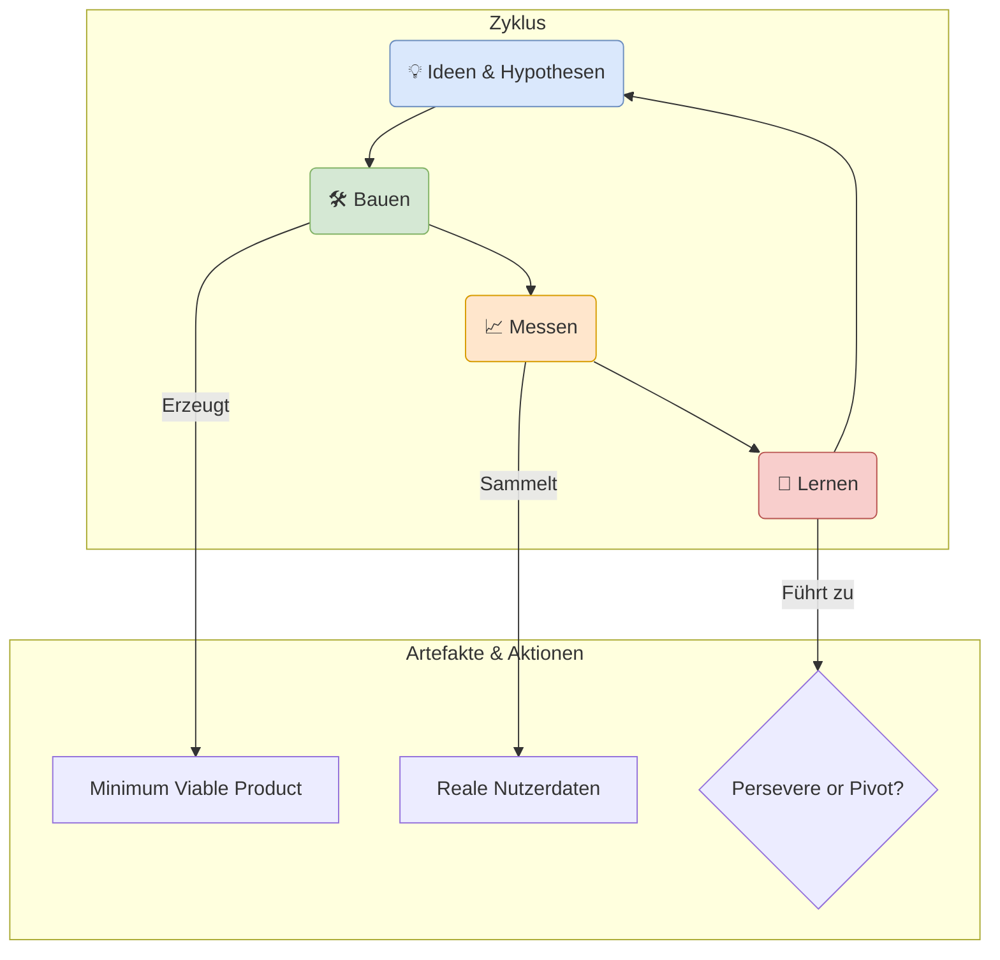

## 3.7. Anforderungsfindung im Startup-Kontext: Lean & MVP

Bisher haben wir uns auf Methoden konzentriert, um ein **bekanntes Problem** für **bekannte Nutzer** zu lösen (z.B. die Digitalisierung einer Schulbibliothek). Doch was passiert, wenn die Idee völlig neu ist? Wenn wir noch nicht einmal sicher wissen, ob ein relevantes Problem existiert?

Hier betreten wir die Welt der Startups. Ein Startup ist kein kleines Unternehmen, sondern eine "menschliche Institution, die unter Bedingungen extremer Unsicherheit ein neues Produkt oder eine neue Dienstleistung entwickelt" (Eric Ries, "The Lean Startup"). Der Prozess der Anforderungsfindung ist hier fundamental anders. Es geht nicht darum, einen perfekten Plan zu erstellen, sondern darum, so schnell und günstig wie möglich zu **lernen**.

Stellen Sie sich den Unterschied zwischen einem Architekten und einem Wissenschaftler vor:
-   **Der Architekt (klassisches RE):** Erstellt einen detaillierten Bauplan für ein bekanntes Problem (ein Haus bauen). Das Ziel ist die perfekte Ausführung des Plans.
-   **Der Wissenschaftler (Startup-Ansatz):** Stellt eine Hypothese auf ("Ich glaube, Menschen haben Problem X") und entwirft ein minimales Experiment (MVP), um diese Hypothese zu testen. Das Ziel ist die Validierung oder Falsifizierung der Annahme.

> :bulb: **Merksatz:** Im Startup-Kontext ist die wichtigste Anforderung nicht eine Funktion, sondern eine **validierte Lern-Erkenntnis**. Das Ziel ist nicht, ein Produkt zu bauen, sondern ein nachhaltiges Geschäftsmodell um ein Produkt herum zu bauen.

### 3.7.1. Der "Build-Measure-Learn"-Zyklus

Der Kern des Startup-Ansatzes ist der von Eric Ries geprägte **Build-Measure-Learn-Zyklus**. Anstatt monatelang ein Produkt im stillen Kämmerlein zu entwickeln, durchläuft man diesen Zyklus so schnell wie möglich, um Hypothesen zu testen.

1.  **Bauen (Build):** Aus einer Idee oder Hypothese wird eine minimale Version des Produkts erstellt – das **Minimum Viable Product (MVP)**. Das Ziel des MVP ist nicht, alle denkbaren Features zu haben, sondern mit minimalem Aufwand maximales Lernen zu ermöglichen. Es ist ein Experiment, kein fertiges Produkt.
    *   *Beispiel:* Statt einer voll funktionsfähigen App zur Prüfungsvorbereitung könnte ein MVP eine einfache Webseite sein, die das Konzept erklärt und einen "Ich will das!"-Button hat.

2.  **Messen (Measure):** Sobald das MVP echten Nutzern zugänglich gemacht wird, beginnt die Mess-Phase. Hier werden quantitative Daten (z.B. "Wie viele Nutzer haben auf den Button geklickt?") und qualitative Daten (z.B. in Interviews) gesammelt. Wichtig ist, **handlungsrelevante Metriken** (Actionable Metrics) zu messen, die eine klare Ursache-Wirkungs-Beziehung zeigen, anstatt "Vanity Metrics" (z.B. reine Seitenzugriffe), die gut aussehen, aber keine Entscheidungen ermöglichen.

3.  **Lernen (Learn):** Dies ist die wichtigste Phase. Die gesammelten Daten werden analysiert, um die ursprüngliche Hypothese zu überprüfen. Das Ergebnis ist eine fundierte Entscheidung:
    *   **Persevere (Weitermachen):** Die Daten bestätigen die Hypothese. Man bleibt auf dem Kurs und startet den nächsten Zyklus, um die nächste Hypothese zu testen (z.B. ein neues Feature zu bauen).
    *   **Pivot (Kurswechsel):** Die Daten widerlegen die Hypothese. Man erkennt, dass die ursprüngliche Strategie nicht funktioniert und nimmt eine grundlegende, strukturelle Änderung am Geschäftsmodell vor (z.B. eine andere Zielgruppe, ein anderes Problem oder eine andere Lösung). Ein Pivot ist kein Scheitern, sondern eine strategische Anpassung basierend auf Gelerntem.

> :mag: **Vertiefung:** Ein Pivot ist keine kleine Änderung, wie die Farbe eines Buttons zu ändern. Es ist eine fundamentale Kurskorrektur. Ein berühmtes Beispiel ist YouTube: Es startete als Video-Dating-Seite. Als die Gründer merkten, dass die Nutzer die Dating-Funktion ignorierten, aber massenhaft Videos aller Art hochluden, machten sie einen Pivot und wurden zur allgemeinen Video-Sharing-Plattform, die wir heute kennen.

Der Build-Measure-Learn-Zyklus ist der Motor, der ein Startup von einer unsicheren Idee zu einem validierten Geschäftsmodell antreibt.

### 3.7.2. Vom Business Model Canvas zur testbaren Hypothese

Woher kommen die Ideen und Hypothesen, die den Zyklus speisen? Während ein klassisches Projekt mit einem Anforderungsdokument startet, beginnt ein Startup mit einer strategischen Landkarte: dem **Business Model Canvas** oder, noch besser für die Frühphase, dem **Lean Canvas**.

> :mag: **Vertiefung: Business Model Canvas vs. Lean Canvas**
>
> Das **Business Model Canvas**, entwickelt von Alexander Osterwalder, ist ein strategisches Werkzeug zur Visualisierung und Entwicklung von Geschäftsmodellen. Es konzentriert sich auf die logischen Zusammenhänge, wie ein Unternehmen Werte schafft, liefert und erfasst. Seine Bausteine sind auf die Ausführung und Skalierung eines Geschäfts ausgerichtet und umfassen Felder wie:
> - **Key Partners (Schlüsselpartner)**
> - **Key Activities (Schlüsselaktivitäten)**
> - **Customer Relationships (Kundenbeziehungen)**
>
> Das **Lean Canvas** von Ash Maurya ist eine Adaption, die speziell auf die Bedürfnisse von Startups in der Frühphase zugeschnitten ist. Es erkennt die hohe Unsicherheit an und ersetzt daher einige der "ausführungsorientierten" Blöcke des Business Model Canvas durch "risikoorientierte" Blöcke:
> - `Key Partners` wird zu **`Problem`**: Der Fokus liegt zuerst auf dem Problem, nicht auf den Partnern.
> - `Key Activities` wird zu **`Solution`**: Die Lösung wird erst definiert, nachdem das Problem verstanden ist.
> - `Customer Relationships` wird zu **`Unfair Advantage` (Unfairer Vorteil)**: Was macht das Geschäftsmodell schwer kopierbar?
> - `Key Resources` wird zu **`Key Metrics` (Schlüsselmetriken)**: Wie wird der Fortschritt gemessen?
>
> Kurz gesagt: Das Business Model Canvas ist ideal, um ein bestehendes Geschäft zu beschreiben oder zu optimieren. Das Lean Canvas ist optimiert, um die riskantesten Annahmen einer *neuen* Idee zu identifizieren und zu testen.

Das Lean Canvas, eine Adaption von Ash Maurya, ist ein einseitiger Businessplan, der die riskantesten Annahmen einer Geschäftsidee in neun Blöcken zusammenfasst. Es ist kein statisches Dokument, sondern ein lebendiges Werkzeug, um das Geschäftsmodell zu skizzieren und zu hinterfragen.

**Struktur des Lean Canvas:**

Für die Anforderungsfindung sind die oberen Blöcke entscheidend. Jeder Eintrag ist eine unbewiesene Annahme, also eine **Hypothese**.

**Der Prozess:**
1.  **Annahmen formulieren:** Das Gründerteam füllt das Canvas mit seinen besten Vermutungen aus.
    *   (1) *Problem:* "Studenten verlieren den Überblick über ihre Lernunterlagen."
    *   (2) *Customer Segments:* "SYP-Schüler im 4. und 5. Jahrgang."
    *   (3) *Unique Value Proposition (UVP):* "Die einzige App, die alle deine Lernzettel automatisch an einem Ort bündelt und dir 30 Minuten pro Woche spart."
    *   (4) *Solution:* "Eine App, die Fotos von Notizen automatisch per OCR in Text umwandelt und verschlagwortet."

2.  **Riskanteste Annahme identifizieren:** Was muss zutreffen, damit die ganze Idee nicht zusammenbricht? Oft ist es die Annahme über das Problem (`Problem-Hypothese`) oder die Annahme, dass die Kunden die Lösung wollen (`Wert-Hypothese` oder `Value Proposition Hypothesis`).

3.  **Testbare Hypothese ableiten:** Die Annahme wird in ein falsifizierbares Format gebracht. Eine gute Vorlage ist:

    > Wir glauben, dass **[Zielgruppe]** das Problem hat, **[Problembeschreibung]**.
    > Wir können ihnen helfen, indem wir **[Lösungsidee]** anbieten.
    > Wir werden wissen, dass wir erfolgreich sind, wenn wir sehen, dass **[messbares Ergebnis/Metrik]**.

    *Beispiel:*
    > "Wir glauben, dass **SYP-Schüler** das Problem haben, **den Überblick über ihre Lernunterlagen zu verlieren**. Wir können ihnen mit einer **automatisch synchronisierenden Lern-App** helfen. Wir werden wissen, dass wir erfolgreich sind, wenn **7 von 10 interviewten Schülern sagen, dass sie für eine solche Lösung 5€ pro Monat zahlen würden**."

Diese eine, klare Hypothese ist nun die "Anforderung" für den nächsten Build-Measure-Learn-Zyklus. Das Ziel des nächsten Experiments (MVP) ist es, genau diese Hypothese zu testen.

> :bulb: **Merksatz:** Das Lean Canvas übersetzt eine vage Idee in eine strukturierte Sammlung von Annahmen. Die Kunst besteht darin, die riskanteste Annahme zu identifizieren und sie in eine testbare Hypothese zu verwandeln, die als Leitfaden für das nächste Experiment dient.

### 3.7.3. Methoden zur Hypothesen-Validierung: Vom Interview zum MVP

Die aus dem Lean Canvas abgeleiteten Hypothesen sind wertlos, solange sie nicht mit der Realität konfrontiert werden. Die "Anforderungserhebung" im Startup-Kontext ist daher ein Prozess der experimentellen Validierung. Ziel ist es, mit möglichst geringem Aufwand (Zeit und Geld) die riskantesten Annahmen zu überprüfen. Man bewegt sich dabei typischerweise von einfachen Gesprächen hin zu funktionalen Prototypen.

#### 1. Problem-Interviews: Existiert das Problem wirklich?

Bevor auch nur eine Zeile Code geschrieben wird, muss die **Problem-Hypothese** validiert werden. Nichts ist teurer, als eine brillante Lösung für ein Problem zu bauen, das niemand hat.

**Ziel:**
- Verstehen, ob die Zielgruppe das angenommene Problem als relevant empfindet.
- Herausfinden, wie sie das Problem heute lösen (Workarounds, Konkurrenzprodukte).
- Die Sprache des Kunden lernen und ihre Prioritäten verstehen.

**Durchführung:**
- **Kein Pitch!** Das Interview ist kein Verkaufsgespräch. Die eigene Lösungsidee wird bewusst zurückgehalten, um ehrliches Feedback zum Problem zu erhalten.
- **Offene Fragen stellen:** Statt "Haben Sie auch das Problem, den Überblick zu verlieren?" fragt man: "Erzählen Sie mir, wie Sie sich auf die letzte Prüfung vorbereitet haben. Was war dabei am mühsamsten?"
- **Nach Geschichten fragen, nicht nach Meinungen:** Menschen sind schlecht darin, ihr eigenes Verhalten vorherzusagen. Fragen Sie nach konkreten, vergangenen Erlebnissen: "Können Sie sich an eine Situation erinnern, in der Sie wichtige Lernunterlagen nicht gefunden haben? Was ist dann passiert?"
- **Zuhören (90% der Zeit):** Das Ziel ist es, zu lernen, nicht zu überzeugen.

> :warning: **Gefahr:** Die häufigste Falle ist das "Pitching" der eigenen Idee. Sobald man die Lösung vorstellt, schalten die meisten Menschen in einen höflichen Modus und geben positives, aber wertloses Feedback ("Ja, klingt super, würde ich nutzen!"), um den Interviewer nicht zu verletzen.

#### 2. Solution-Interviews: Würden Kunden diese Lösung nutzen?

Wenn die Problem-Interviews die Problem-Hypothese bestätigt haben, kann man die **Wert-Hypothese** testen. Jetzt wird ein erster, minimaler Lösungsansatz präsentiert.

**Ziel:**
- Validieren, ob die vorgeschlagene Lösung das Problem effektiv adressiert.
- Frühes Feedback zum Konzept und zu den wichtigsten Features sammeln.
- Die Kauf- oder Nutzungsbereitschaft testen (Commitment).

**Durchführung:**
- **Minimaler Prototyp:** Die Lösung wird nicht als fertiges Produkt, sondern als einfacher Prototyp präsentiert (z.B. eine Skizze, ein Mockup, eine Power-Point-Präsentation).
- **Commitment einfordern:** Das stärkste Signal für eine erfolgreiche Validierung ist nicht positives Feedback, sondern ein echtes Commitment des Kunden. Dies kann sein:
    - **Zeit:** "Wären Sie bereit, nächste Woche 30 Minuten an einem Usability-Test teilzunehmen?"
    - **Geld:** "Die App wird 5€ pro Monat kosten. Wären Sie bereit, sich jetzt für einen vergünstigten Preis von 2€ voranzumelden?"
    - **Reputation:** "Können Sie mir drei Kollegen vorstellen, für die das ebenfalls interessant wäre?"

> :bulb: **Merksatz:** Nettes Feedback ("Das ist eine tolle Idee!") ist wertlos. Ein echtes Commitment (Zeit, Geld, Reputation) ist der einzige harte Beweis für eine validierte Hypothese.

#### 3. Das Minimum Viable Product (MVP): Lernen durch Handeln

Ein MVP ist kein unfertiges Produkt, sondern ein **minimales Experiment**, um eine spezifische Hypothese zu testen. Es geht darum, mit dem geringstmöglichen Aufwand den Build-Measure-Learn-Zyklus zu durchlaufen. Es gibt viele Formen von MVPs, die oft gar keine oder nur sehr wenig Programmierung erfordern.

**Wichtige MVP-Typen:**

| MVP-Typ | Beschreibung | Beispiel | Was wird gelernt? |
| :--- | :--- | :--- | :--- |
| **Landing-Page-MVP** | Eine einfache Webseite, die das Wertversprechen (UVP) erklärt und eine Handlungsaufforderung (Call-to-Action) enthält, z.B. eine E-Mail-Anmeldung. | Eine Seite beschreibt die "Lernzettel-App" und hat einen Button "Bei Launch benachrichtigt werden". | Interesse am Wertversprechen; Konversionsrate (wie viele Besucher tragen sich ein?). |
| **Concierge-MVP** | Die Dienstleistung wird komplett manuell für einen oder wenige erste Kunden erbracht. Es gibt keine Technologie, nur menschlichen Service. | Ein Gründer bietet an, die Lernzettel eines Schülers persönlich per Hand zu digitalisieren und zu sortieren. | Direkte Beobachtung des Kundenproblems; welche Schritte sind wirklich wertvoll? |
| **Wizard-of-Oz-MVP** | Das Produkt sieht für den Nutzer wie eine vollautomatische Software aus, aber im Hintergrund werden alle Prozesse manuell von Menschen ausgeführt. | Eine App hat einen Button "Notizen scannen & verschlagworten". Klickt der Nutzer, wird das Bild an einen Gründer gesendet, der es abtippt und zurückschickt. | Test der User Experience und des Feature-Bedarfs, bevor die komplexe Technologie gebaut wird. |
| **Single-Feature-MVP** | Eine erste Version des Produkts, die sich auf **ein einziges, zentrales Feature** konzentriert, das das Kernproblem löst. | Die Lern-App kann nur eine einzige Sache: Fotos von Notizen machen und in einem Ordner speichern. Keine Tags, keine Suche, kein OCR. | Wird das Kern-Feature überhaupt genutzt? Löst es den größten Schmerzpunkt? |

Die Wahl des richtigen MVP-Typs hängt von der Hypothese ab, die getestet werden soll. Ein Landing-Page-MVP testet das Interesse am Marketing-Versprechen, während ein Concierge-MVP tiefes Verständnis für den Lösungsprozess liefert. Das Ziel bleibt immer dasselbe: **maximales validiertes Lernen bei minimalem Aufwand.**

***
**Quellen und weiterführende Literatur:**

- **Ries, Eric. (2011). *The Lean Startup: How Today's Entrepreneurs Use Continuous Innovation to Create Radically Successful Businesses.***
  - *Das grundlegende Werk, das den Build-Measure-Learn-Zyklus und die Philosophie des validierten Lernens populär gemacht hat.*
- **Maurya, Ash. (2012). *Running Lean: Iterate from Plan A to a Plan That Works.***
  - *Die entscheidende Weiterentwicklung des Business Model Canvas zum Lean Canvas. Ein praktischer Leitfaden zur Umsetzung der Lean-Startup-Prinzipien.*
- **Fitzpatrick, Rob. (2013). *The Mom Test: How to Talk to Customers & Learn If Your Business Is a Good Idea When Everyone Is Lying to You.***
  - *Ein unverzichtbarer Leitfaden für die Durchführung von Problem- und Solution-Interviews, um ehrliches, unvoreingenommenes Feedback zu erhalten.*
***
