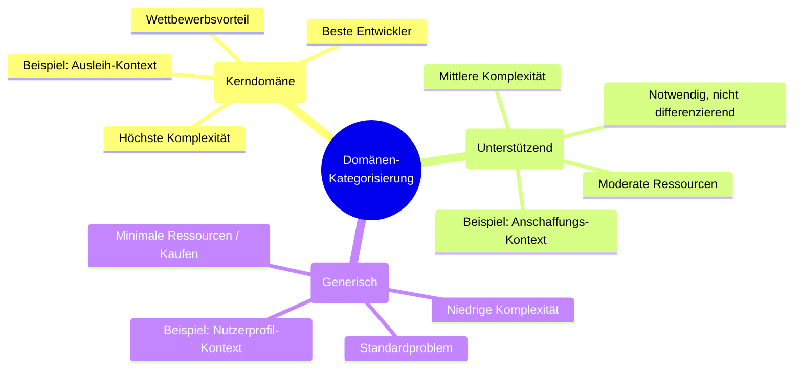
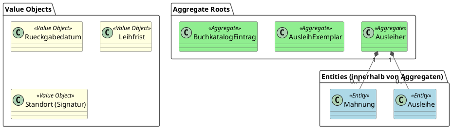
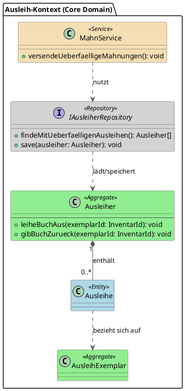
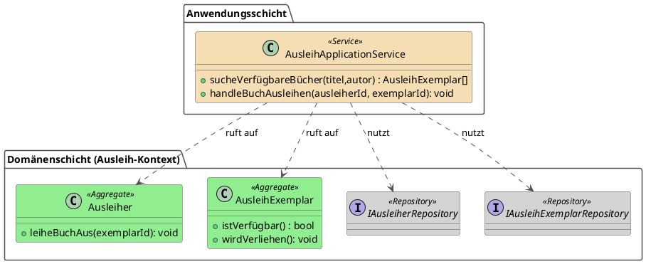
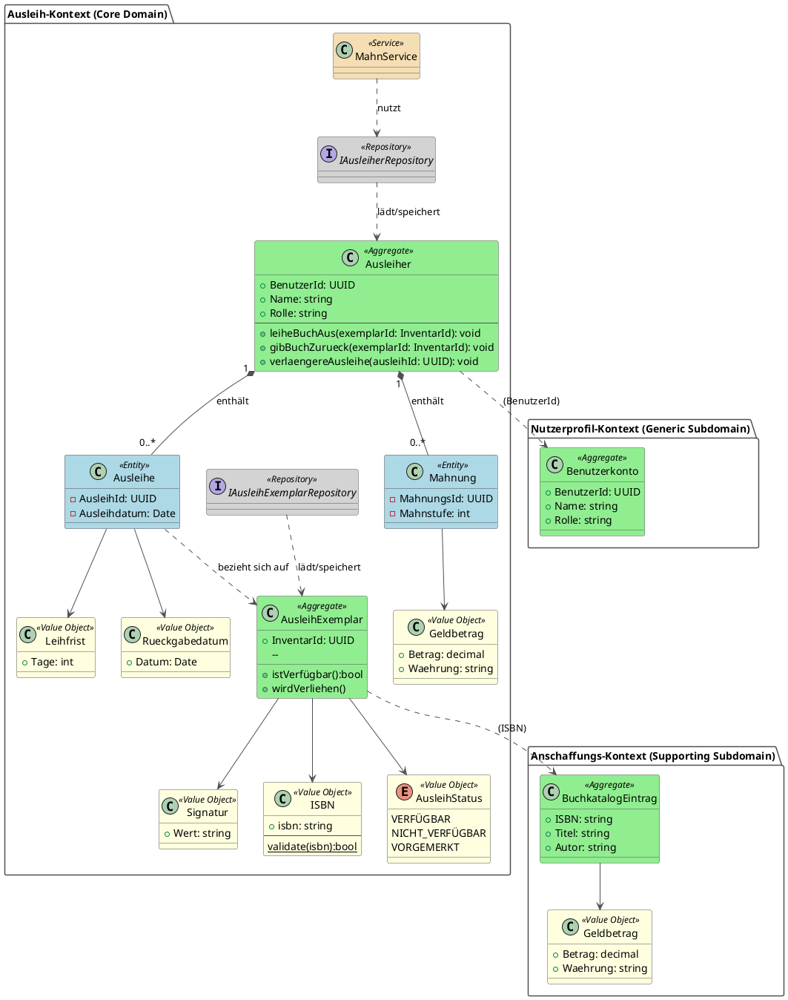

## 4.1 Mit Domain-Driven-Design zum Domain-Modell

Bisher haben wir gelernt, wie man Anforderungen erhebt, in User Stories formuliert und durch Workshops mit Stakeholdern verfeinert. Doch wie gelangen wir von diesen nutzerzentrierten Anforderungen zu einem robusten technischen Fundament? Die Antwort liegt in der Erstellung eines **Domain-Modells** – einer strukturierten Abbildung der Geschäftslogik, die als solides Fundament für alle nachfolgenden Architekturentscheidungen dient.

In diesem Kapitel lernen Sie, wie Sie mit **Domain-Driven Design (DDD)** ein vollständiges Domain-Modell entwickeln, das:
- Die **Domänen** Ihrer Anwendung identifiziert und nach ihrer Wichtigkeit kategorisiert (Core Domain, Supporting Subdomain, Generic Subdomain)
- Für jede Domäne die zentralen **Aggregate** mit ihren Entitäten und Value Objects definiert
- Die **Geschäftslogik** in Form von Methoden den richtigen Aggregaten zuordnet
- Die **Grenzen zwischen Domänen** (Bounded Contexts) klar definiert

Dieses Domain-Modell ist nicht nur eine theoretische Übung – es bildet die **Grundlage für die Wahl der passenden Software-Architektur(en)**. Verschiedene Domänen haben unterschiedliche Anforderungen: Ihre Core Domain benötigt möglicherweise eine hochflexible, wartbare Architektur (z.B. Clean Architecture), während für Generic Subdomains eine einfache Standardlösung ausreicht. Das Domain-Modell zeigt uns, wo wir in Qualität investieren müssen und wo Pragmatismus angebracht ist.

> 🎯 **Ziel dieses Kapitels:** Am Ende haben Sie ein vollständiges, visuell dokumentiertes Domain-Modell, das jeden Bounded Context mit seinen Aggregaten, Entitäten, Value Objects und deren Beziehungen zeigt – bereit, als Blueprint für die Architekturentscheidungen.

### 4.1.1 Was ist Domain-Driven Design?

Angenommen, Sie sollen eine Software für die Logistik eines großen Online-Händlers entwickeln. Die Fachabteilung spricht von "Sendungsverfolgung", "Retourenmanagement" und "Lagerbestand". Wenn die Entwickler in ihrem Code jedoch nur mit generischen Begriffen wie `DataManager`, `ItemProcessor` oder `StatusUpdater` arbeiten, entsteht eine Kluft. Missverständnisse sind vorprogrammiert und die Software wird mit der Zeit immer schwerer an neue Geschäftsprozesse anpassbar sein.

**Domain-Driven Design (DDD)** ist ein Ansatz zur Softwareentwicklung, der genau dieses Problem löst. Es ist eine Sammlung von Prinzipien und Mustern, die darauf abzielen, eine tiefe Verbindung zwischen dem Code und dem Geschäftsmodell (der **Domäne**) herzustellen.

-   **Definition:** DDD ist kein spezifisches Framework, sondern eine Philosophie, die das Hauptaugenmerk auf die **Kerndomäne** (den wichtigsten, komplexesten Teil des Geschäfts) legt. Das Ziel ist es, ein reichhaltiges, ausdrucksstarkes **Modell** dieser Domäne zu erstellen, das als Herzstück der Software dient.
-   **Zweck:** Die drei Hauptziele von DDD sind:
    1.  **Komplexität bewältigen:** Indem man sich auf das Geschäftsfeld konzentriert und es präzise modelliert, wird die inhärente Komplexität der Domäne beherrschbar.
    2.  **Kommunikation verbessern:** DDD etabliert eine gemeinsame, allgegenwärtige Sprache (**Ubiquitous Language**), die von Fachexperten und Entwicklern gleichermaßen gesprochen wird. Dies reduziert Missverständnisse drastisch.
    3.  **Langlebige Architektur schaffen:** Eine Software, deren Struktur die Domäne widerspiegelt, ist leichter zu verstehen, zu warten und zu erweitern, da Änderungen im Geschäft sich logisch im Code abbilden lassen.

> :bulb: **Merksatz:** Bei Domain-Driven Design geht es darum, die Sprache des Geschäfts zur Sprache des Codes zu machen. Die Software wird zu einem lebendigen Modell der realen Geschäftsprozesse.

### 4.1.2 Die zwei Säulen von DDD: Strategisches und Taktisches Design

Domain-Driven Design ist kein monolithischer Block, sondern gliedert sich in zwei große, miteinander verbundene Disziplinen: **Strategisches Design** und **Taktisches Design**. Man kann sie sich wie den Plan eines Städtebauers und die Baupläne eines einzelnen Architekten vorstellen.

1.  **Strategisches Design (Der Städteplaner):**
    -   **Fokus:** Das große Ganze, die Makro-Ebene. Hier geht es darum, die gesamte Geschäftsdomäne zu verstehen und in logische, voneinander unabhängige Teilbereiche zu zerlegen.
    -   **Analogie:** Der Städteplaner legt fest, wo das Wohngebiet, das Industriegebiet und das Einkaufsviertel liegen. Er definiert die großen Verkehrsadern, die diese Gebiete verbinden, und sorgt dafür, dass die Infrastruktur in jedem Viertel passt (im Wohngebiet gelten andere Anforderungen an die Infrastruktur sls im Industriegebiet).
    -   **Zentrale Fragen:** Was sind die verschiedenen Teilbereiche unseres Geschäfts? Wie hängen sie zusammen? Wo liegen die Grenzen? Welches ist der wichtigste Teil (die Kerndomäne), in den wir die meiste Energie investieren müssen?

2.  **Taktisches Design (Der Architekt):**
    -   **Fokus:** Das Detail, die Mikro-Ebene. Hier geht es um die konkrete Ausgestaltung des Modells *innerhalb* eines einzelnen, klar abgegrenzten Bereichs.
    -   **Analogie:** Der Architekt nimmt sich einen vom Städteplaner definierten Bereich – z.B. das Wohngebiet – und entwirft die detaillierten Baupläne für ein einzelnes Haus. Er legt fest, welche Räume es gibt (Entitäten), welche Elektroanschlüsse, Heizkörper oder ähnliches für die Räume vorzusehen sind (Aggregate) und welche statische Bedingungen (Regeln) einzuhalten sind.
    -   **Zentrale Fragen:** Aus welchen Bausteinen besteht unser Modell? Wie repräsentieren wir ein "Kundenkonto" oder eine "Bestellung" im Code? Wie stellen wir sicher, dass Geschäftsregeln (z.B. "Ein Konto kann nicht überzogen werden") immer eingehalten werden?

> :mag: **Vertiefung:** Strategisches und Taktisches Design sind untrennbar miteinander verbunden. Gutes strategisches Design schafft die Voraussetzung für effektives taktisches Design. Ohne klare Grenzen (strategisch) wird das Modell im Inneren (taktisch) chaotisch. Umgekehrt hilft die Detailarbeit im Taktischen Design oft dabei, die strategischen Grenzen besser zu verstehen und zu schärfen. Man beginnt oft mit einer groben strategischen Sicht, verfeinert sie durch taktische Implementierung und passt die Strategie bei Bedarf wieder an.

### 4.1.3 Strategisches Design: Die große Landkarte

Das strategische Design ist der erste und wichtigste Schritt im DDD. Es zwingt uns, einen Schritt zurückzutreten und das Geschäft als Ganzes zu betrachten, bevor wir eine einzige Zeile Code schreiben. Das Ziel ist es, eine "Landkarte" der Domäne zu erstellen, die uns hilft, uns zu orientieren, Grenzen zu ziehen und unsere Kräfte auf die wichtigsten Gebiete zu konzentrieren. Die zentralen Werkzeuge dafür sind die **Kategorisierung der Domänen**, die **Ubiquitous Language** und **Bounded Contexts**.

#### 4.1.3.1 Kategorisierung der Domänen: Wo investieren wir unsere Energie?

Nicht alle Teile einer Software sind gleich wichtig. Manche Bereiche sind das Herzstück des Geschäfts und bieten echte Wettbewerbsvorteile, andere sind notwendig, aber nicht differenzierend. Das strategische Design beginnt damit, die verschiedenen Teile der Geschäftsdomäne in drei Kategorien einzuteilen, um bewusst zu entscheiden, wo die wertvollsten Entwicklungsressourcen investiert werden sollen.

**1. Core Domain (Kerndomäne): Das Herz des Geschäfts**

Die **Core Domain** ist der Teil der Domäne, der den größten Geschäftswert liefert und das Unternehmen von der Konkurrenz unterscheidet. Hier liegt die einzigartige Expertise und der Wettbewerbsvorteil.

-   **Merkmale:**
    -   Hohe fachliche Komplexität
    -   Ständige Weiterentwicklung und Änderungen
    -   Starke Einbindung von Fachexperten notwendig
    -   Größter Return on Investment (ROI)
-   **Strategie:** Hier investieren wir die **besten Entwickler**, die **meiste Zeit** und die **höchste Qualität**. Das Modell muss reichhaltig, ausdrucksstark und flexibel sein. Dies ist **nicht** der Ort für "Quick & Dirty"-Lösungen oder generische Frameworks.

**Beispiel Schulbibliothek:**
Der **Ausleih-Kontext** ist unsere Core Domain. Warum?
-   Er implementiert die zentralen Geschäftsprozesse: Ausleihe, Rückgabe, Vormerkung, Mahnwesen.
-   Die Regeln sind komplex und speziell: unterschiedliche Leihfristen für Schüler und Lehrer, Ausleihlimits, Strafgebühren bei verspäteter Rückgabe.
-   Hier kann die Schule sich von anderen Bibliotheken unterscheiden (z.B. durch ein besonders benutzerfreundliches Vormerk-System).
-   **Investition:** Die Fachlogik für das Ausleihlimit ("Ein Schüler darf maximal 5 Bücher ausleihen") wird als explizite Geschäftsregel im `Ausleiher`-Aggregat modelliert, nicht in einer generischen Validierungsklasse versteckt.

**2. Supporting Subdomain (Unterstützende Teildomäne): Notwendig, aber nicht einzigartig**

Eine **Supporting Subdomain** ist ein Bereich, der für das Geschäft notwendig ist, aber keinen Wettbewerbsvorteil bietet. Die Logik ist zwar spezifisch für das Unternehmen, aber nicht besonders komplex oder innovativ.

-   **Merkmale:**
    -   Mittlere fachliche Komplexität
    -   Unterstützt die Core Domain
    -   Individuell, aber nicht differenzierend
    -   Könnte theoretisch auch von einem anderen Unternehmen ähnlich gelöst werden
-   **Strategie:** Hier investieren wir **moderate Ressourcen**. Das Modell sollte korrekt und wartbar sein, aber es rechtfertigt nicht den gleichen Perfektionismus wie die Core Domain. Oft ist es sinnvoll, hier mit weniger aufwändigen Patterns zu arbeiten oder sogar Teile **outzusourcen** oder durch **Standard-Software** zu ersetzen, wenn möglich.

**Beispiel Schulbibliothek:**
Der **Anschaffungs-Kontext** ist eine Supporting Subdomain. Warum?
-   Die Schule muss neue Bücher bestellen können, das ist notwendig.
-   Der Prozess (Bestellung, Rechnung, Lieferantenverwaltung) ist aber nicht einzigartig. Viele Organisationen machen ähnliche Dinge.
-   Die Bibliothek wird nicht dadurch besser, dass sie ein super ausgefeiltes Bestellsystem hat. Ein einfaches, funktionales System reicht völlig.
-   **Investition:** Ein simples CRUD-Interface (Create, Read, Update, Delete) für `BuchkatalogEintrag` mit Grundvalidierungen ist hier ausreichend. Wir benötigen kein komplexes Aggregat mit ausgefeilten Geschäftsregeln.

**3. Generic Subdomain (Generische Teildomäne): Standard-Problem, Standard-Lösung**

Eine **Generic Subdomain** ist ein Bereich, für den es bereits etablierte, allgemeine Lösungen gibt. Die Problemstellung ist nicht spezifisch für das Unternehmen.

-   **Merkmale:**
    -   Niedrige fachliche Komplexität
    -   Keine Unternehmensspezifika
    -   Standardproblem, das viele Unternehmen haben
    -   Bietet keinen Wettbewerbsvorteil
-   **Strategie:** Hier investieren wir **minimale Ressourcen**. Die beste Lösung ist oft, **bestehende Bibliotheken, Frameworks oder externe Services** zu nutzen (kaufen statt bauen). Wenn wir doch selbst entwickeln, halten wir es so einfach wie möglich.

**Beispiel Schulbibliothek:**
Der **Nutzerprofil-Kontext** (Benutzerverwaltung, Authentifizierung) ist eine Generic Subdomain. Warum?
-   Jede Anwendung benötigt Benutzerverwaltung und Login.
-   Die Anforderungen (Benutzername, Passwort, Rollen) sind Standard.
-   Es gibt unzählige fertige Lösungen: Identity-Server, OAuth-Provider, fertige User-Management-Bibliotheken.
-   **Investition:** Wir nutzen eine bewährte Authentifizierungslösung (z.B. ASP.NET Core Identity, Keycloak, Auth0) statt ein eigenes System zu bauen. Wenn wir es doch selbst machen, ist ein einfaches Datenmodell mit `Benutzerkonto` als Entität ausreichend.

> 🔧 **Praxis-Tipp: Die 80/20-Regel**
>
> In den meisten Projekten macht die Core Domain nur etwa 20% des Codes aus, liefert aber 80% des Geschäftswerts. Die größte Herausforderung im strategischen Design ist es, diese 20% zu identifizieren und **bewusst** die meisten Ressourcen darauf zu konzentrieren. Viele Projekte scheitern, weil sie ihre Energie gleichmäßig verteilen und am Ende überall Mittelmaß produzieren, statt in der Core Domain Exzellenz zu erreichen.

Das folgende Diagramm visualisiert die drei Domänen-Kategorien mit ihren charakteristischen Eigenschaften und zeigt die Ressourcenverteilung:

> :warning: **Achtung: Kategorisierung ist kontextabhängig!**
>
> Was für ein Unternehmen eine Core Domain ist, kann für ein anderes eine Generic Subdomain sein. Für Amazon ist die Logistik (Routenoptimierung, Lagerverwaltung) eine Core Domain, da sie sich dadurch von der Konkurrenz abheben. Für unsere Schulbibliothek wäre ein komplexes Lagerverwaltungssystem völlig überdimensioniert – hier würde eine einfache `Signatur` (Standort) als Value Object völlig ausreichen. Die Kategorisierung muss immer aus der Perspektive des konkreten Geschäftskontexts erfolgen.

#### 4.1.3.2 Ubiquitous Language (Allgegenwärtige Sprache)

Die größte Quelle für Fehler in Softwareprojekten sind Missverständnisse zwischen Fachexperten und Entwicklern. Die Fachabteilung sagt "Kunde", meint aber nur "Endverbraucher", während die Entwickler auch "Geschäftskunden" darunter verstehen. Das Ergebnis ist Chaos.

Die **Ubiquitous Language** ist die Lösung für dieses Problem. Es ist ein gemeinsames, von allen Projektbeteiligten – Entwicklern, Fachexperten, Managern – aktiv genutztes und entwickeltes Vokabular. Diese Sprache ist nicht nur eine Liste von Begriffen, sie ist die Sprache des Modells und wird direkt im Code verwendet (z.B. als Klassen- und Methodennamen).

**Beispiel: Die Schulbibliothek**
Im Workshop zur Schulbibliothek (siehe Kapitel 3.3.3) tauchten verschiedene Begriffe auf. Das Team muss sich auf eine einheitliche Sprache einigen:
-   Heißt es **"Vormerkung"** oder **"Reservierung"**? Das Team einigt sich auf **"Vormerkung"**, da "Reservierung" für Lehrer, die ganze Klassensätze bestellen, eine andere Bedeutung hat.
-   Ein Schüler, der ein Buch hat, ist ein **"Ausleiher"**. Der Vorgang ist die **"Ausleihe"**.
-   Ein Buch, das nicht zurückgegeben wurde, ist **"überfällig"**. Der Prozess, den Ausleiher zu erinnern, ist das **"Mahnwesen"**.

Diese Begriffe werden nun überall exakt so verwendet: in Meetings, in der Dokumentation und vor allem im Code (`class Ausleihe`, `function sendeMahnung()`).

#### 4.1.3.3 Bounded Context (Abgegrenzter Kontext)

Eine Sprache ist nur innerhalb eines bestimmten Kontextes eindeutig. Das Wort "Bank" bedeutet im Finanzwesen etwas anderes als im Park. Ein **Bounded Context** ist eine explizite Grenze (z.B. ein Modul, ein Microservice), innerhalb derer ein bestimmtes Domänenmodell und eine bestimmte Ubiquitous Language gelten.

Innerhalb eines Bounded Context ist jeder Begriff eindeutig. Außerhalb kann er etwas völlig anderes bedeuten. Das strategische Design hilft uns, diese Grenzen zu finden und zu definieren.

**Beispiel: Die Schulbibliothek**
In unsere Schulbibliotheksbeispiel gibt es nun verschiedene Arten von Büchern. Hier machen das durch die Namensgebung in der Ubiquitous Language explizit:

1.  **Ausleih-Kontext (Core Domain):** Das ist das Herzstück. Hier geht es um das physische Exemplar im Regal.
    -   **Sprache:** `Ausleihe`, `Ausleiher`, `Rückgabefrist`, `Mahnung`.
    -   Das Modell hier nennen wir **`AusleihExemplar`**. Es ist eine Entität mit einer eindeutigen `InventarId` und hat Attribute wie `Ausleihstatus` und `Signatur` (Standort). Es trägt auch die `ISBN` als Referenz.

2.  **Anschaffungs-Kontext (Supporting Subdomain):** Hier kümmert sich Frau Müller um die Bestellung neuer Bücher. Hier geht es um das Buch als bestellbares Produkt.
    -   **Sprache:** `Bestellung`, `Lieferant`, `Rechnung`, `Budget`.
    -   Das Modell hier nennen wir **`BuchkatalogEintrag`**. Es ist ebenfalls eine Entität mit der `ISBN` als primärer ID und hat Attribute wie `Titel`, `Preis` und `Lieferant`. Der `Ausleihstatus` ist hier völlig **irrelevant**.

3.  **Nutzerprofil-Kontext (Generic Subdomain):** Hier werden die Daten der Schüler und Lehrer verwaltet.
    -   **Sprache:** `Benutzerkonto`, `Passwort`, `Rolle` (Schüler/Lehrer), `Klasse`.
    -   Ein `Benutzer` hat hier Attribute wie `Name` und `E-Mail`. Ob er gerade Bücher ausgeliehen hat, ist für diesen Kontext nicht von primärem Interesse.

> :warning: **Achtung:** Indem wir die Kontexte trennen, vermeiden wir ein riesiges "Gott-Objekt" `Buch`. Stattdessen haben wir zwei spezialisierte Modelle: das **`AusleihExemplar`** im Ausleih-Kontext und den **`BuchkatalogEintrag`** im Anschaffungs-Kontext. Die Verknüpfung zwischen diesen beiden erfolgt **nicht** über eine gemeinsame Klasse oder Vererbung, sondern über eine **gemeinsame, stabile ID** – die `ISBN` ist hierfür der perfekte Kandidat. So kann der Ausleih-Kontext bei Bedarf Informationen (wie den Titel) aus dem Anschaffungs-Kontext abfragen, ohne dessen internes Modell kennen zu müssen. Das ist die Kernidee des strategischen Designs: Komplexität durch klare Grenzen und lose Kopplung beherrschen.

> :mag: **Vertiefung: Warum keine gemeinsame Basisklasse für `Buch`?**
>
> Die intuitive Idee, eine abstrakte `Buch`-Basisklasse zu verwenden, ist ein klassisches Anti-Pattern im DDD. Der Grund liegt in der **Kopplung**:
> - **Enge Kopplung:** Eine gemeinsame Basisklasse koppelt die Kontexte eng aneinander. Eine Änderung an der Basisklasse (z.B. im Anschaffungs-Team) würde sofort den Ausleih-Kontext beeinflussen und könnte dort zu Fehlern führen. Die Autonomie der Teams geht verloren.
> - **Verletzung der Grenzen:** Das Modell wird zu einem Kompromiss, der keinem Kontext richtig dient. Der Ausleih-Kontext wird mit für ihn irrelevanten Daten und Logiken aus der Anschaffung belastet und umgekehrt.
>
> Die DDD-Lösung – getrennte Modelle (`AusleihExemplar`, `BuchkatalogEintrag`), die nur über eine ID (`ISBN`) lose gekoppelt sind – maximiert die **Autonomie** und **Wartbarkeit**. Jeder Kontext kann sein Modell perfekt auf seine Bedürfnisse zuschneiden, ohne andere Kontexte zu beeinträchtigen.

### 4.1.4 Taktisches Design: Die Bausteine der Software

Nachdem das strategische Design die Landkarte und die Grenzen (Bounded Contexts) festgelegt hat, gibt uns das taktische Design die konkreten Werkzeuge an die Hand, um das Modell *innerhalb* eines Kontexts zu bauen. Dies sind die fundamentalen Bausteine, aus denen reichhaltige Domänenmodelle entstehen.

#### 4.1.4.1 Entities & Value Objects: Die Grundbausteine

Jedes Modell besteht aus Objekten, aber nicht alle Objekte sind gleich. DDD unterscheidet hier fundamental zwischen zwei Arten:

1.  **Entity (Entität):** Ein Objekt, das nicht durch seine Attribute, sondern durch seine **eindeutige Identität** und seinen Lebenszyklus definiert wird.
    -   **Merkmal:** Es hat eine ID. Wenn sich seine Attribute ändern (z.B. der Nachname einer Person durch Heirat), bleibt es trotzdem dasselbe Objekt.
    -   **Beispiel Schulbibliothek:**
        -   Ein **`Ausleiher`** (Schüler oder Lehrer) ist eine klassische Entität. Jeder Ausleiher hat eine eindeutige Mitgliedsnummer. Auch wenn er die Klasse wechselt oder umzieht, bleibt er dieselbe Person.
        -   Das physische **`Buch`** im `Ausleih-Kontext` ist ebenfalls eine Entität. Jedes einzelne Exemplar von "Harry Potter" hat eine eindeutige Inventarnummer. Es ist wichtig zu wissen, ob *genau dieses Exemplar* gerade ausgeliehen oder beschädigt ist.

2.  **Value Object (Werteobjekt):** Ein Objekt, das durch seine Attribute definiert wird und keine eigene Identität hat.
    -   **Merkmal:** Es hat keine ID. Zwei Value Objects mit denselben Attributen sind austauschbar und gleich. Sie sind oft unveränderlich (immutable).
    -   **Beispiel Schulbibliothek:**
        -   Die **`ISBN`** eines Buches ist ein Value Object. Zwei `ISBN`-Objekte mit dem Wert "978-3-551-55743-7" sind identisch.
        -   Eine **`Anschrift`** bestehend aus Straße, PLZ und Ort ist ein Value Object. Wenn zwei Schüler in derselben WG wohnen, haben sie dieselbe Anschrift. Es ist nicht wichtig, *welches* Anschrift-Objekt man verwendet, solange die Werte stimmen.
        -   Die **`Rückgabefrist`** ist ebenfalls ein Value Object. Sie wird durch ein Datum definiert und hat keine eigene Identität.

#### 4.1.4.2 Aggregate: Die Konsistenz-Grenze

Ein zentrales Problem in komplexen Systemen ist die Einhaltung von Geschäftsregeln (Invarianten), die mehrere Objekte betreffen. Zum Beispiel: "Ein Ausleiher darf nicht mehr als 5 Bücher gleichzeitig ausleihen."

Ein **Aggregat** ist eine Gruppe von zusammengehörigen Objekten (Entitäten und Value Objects), die als eine einzige Einheit für Datenänderungen behandelt wird. Jedes Aggregat hat eine Wurzel, die **Aggregate Root**, die als einziger Einstiegspunkt für alle Operationen auf dem Aggregat dient.

-   **Zweck:** Sicherstellung der Konsistenz. Geschäftsregeln, die sich über mehrere Objekte erstrecken, werden innerhalb des Aggregats garantiert.
-   **Regeln:**
    1.  Von außerhalb des Aggregats darf nur auf die Aggregate Root zugegriffen werden.
    2.  Objekte innerhalb des Aggregats können Referenzen aufeinander halten.
    3.  Nur die Aggregate Root darf von außerhalb referenziert werden.

**Beispiel Schulbibliothek:**
Im `Ausleih-Kontext` ist der **`Ausleiher`** eine perfekte Aggregate Root.
-   Das `Ausleiher`-Aggregat umfasst die `Ausleiher`-Entität selbst und eine Liste seiner aktuellen `Ausleihe`-Objekte.
-   **Geschäftsregel:** "Ein Schüler darf maximal 5 Bücher ausleihen."
-   **Umsetzung:** Die Methode `leiheBuchAus(buch)` existiert nur auf der `Ausleiher`-Entität. Bevor eine neue `Ausleihe` zur Liste hinzugefügt wird, prüft diese Methode: "Ist die Rolle 'Schüler' UND ist die Anzahl der aktuellen Ausleihen < 5?". Nur wenn diese Bedingung erfüllt ist, wird die Operation ausgeführt. So wird die Regel niemals verletzt. Man kann nicht einfach von außen eine `Ausleihe` erzeugen und sie dem `Ausleiher` zuweisen.

#### 4.1.4.3 Repositories & Services: Zugriff und Operationen

Nachdem wir unsere Modelle mit Entities, Value Objects und Aggregaten gebaut haben, brauchen wir noch Mechanismen, um mit ihnen zu arbeiten.

1.  **Repository (Repositorium):** Dient dem Laden und Speichern von Aggregaten. Es verhält sich nach außen wie eine Sammlung im Speicher.
    -   **Zweck:** Abstraktion der Datenbank. Das Domänenmodell muss nicht wissen, ob die Daten in einer SQL-Datenbank, einer NoSQL-Datenbank oder einer Datei gespeichert werden.
    -   **Beispiel Schulbibliothek:** Es gäbe ein `IAusleiherRepository` mit Methoden wie `GetById(ausleiherId)` oder `Save(ausleiher)`. Der Code, der eine Ausleihe durchführt, würde das `Ausleiher`-Aggregat über das Repository laden, die `leiheBuchAus`-Methode aufrufen und das geänderte Aggregat dann wieder über das Repository speichern.

2.  **Domain Service (Domänendienst):** Manchmal passt eine wichtige Geschäftsoperation nicht in die Verantwortung eines einzelnen Aggregats.
    -   **Zweck:** Kapselung von Geschäftslogik, die mehrere Aggregate oder externe Systeme involviert.
    -   **Beispiel Schulbibliothek:** Das **Mahnwesen**. Der Prozess "Sende allen überfälligen Ausleihern eine Mahnung" gehört nicht zu einem einzelnen `Ausleiher`. Ein `MahnService` würde das `AusleiherRepository` nutzen, um alle relevanten Ausleiher zu laden, zu prüfen, welche Ausleihen überfällig sind, und dann z.B. einen E-Mail-Dienst aufrufen.

> :mag: **Wichtige Frage: Wer koordiniert die Aggregate?**
>
> Man könnte annehmen, dass die `leiheBuchAus`-Methode des `Ausleiher`-Aggregats das `IAusleihExemplarRepository` benötigt, um den Zustand des Buches zu ändern. Dies ist jedoch ein absichtliches Anti-Pattern in DDD. Aggregate sollten niemals direkt voneinander oder von den Repositories anderer Aggregate abhängig sein. Die Koordination von Operationen, die mehrere Aggregate umfassen (wie das Laden eines `Ausleihers` und eines `AusleihExemplars`), ist die Aufgabe einer übergeordneten Schicht, des **Application Service**. Dieses wichtige Konzept wird im Abschnitt 4.1.6 detailliert erläutert.

> 🔧 **Praxis-Tipp:** Das taktische Design gibt Ihnen ein mächtiges Vokabular, um reichhaltige, ausdrucksstarke und konsistente Domänenmodelle zu bauen. Der Schlüssel ist, Geschäftsregeln nicht in anonymen Service-Klassen zu verstecken, sondern sie so nah wie möglich an die Daten zu binden, die sie schützen – idealerweise innerhalb eines Aggregats.

### 4.1.5 Der Weg von User Stories zum Domänenmodell

Nachdem wir die Anforderungen in Form von User Stories erfasst haben (wie in Kapitel 3.3.3 beschrieben), stellt sich die Frage: Wie gelangen wir von diesen nutzerzentrierten Beschreibungen zu einem robusten, technischen Domänenmodell, wie wir es im Diagramm visualisiert haben? Der Schlüssel liegt darin, die in den User Stories enthaltene **Ubiquitous Language** systematisch zu analysieren, um die Bausteine des taktischen Designs – Aggregate, Entitäten und Value Objects – zu identifizieren.

Dieser Prozess ist keine einmalige, lineare Transformation, sondern ein iterativer Prozess des Modellierens und Verfeinerns.

#### 4.1.5.1 Schritt 1: Nomen und Verben in User Stories identifizieren

Der erste Schritt ist, die User Stories und ihre Akzeptanzkriterien sorgfältig zu "sezieren". Wir suchen nach Substantiven (Nomen) und Verben, da sie uns erste Hinweise auf die Objekte und Operationen in unserer Domäne geben.

-   **Nomen** sind Kandidaten für **Aggregate, Entitäten oder Value Objects**.
-   **Verben** sind Kandidaten für **Methoden auf Aggregaten** oder für **Domain Services**.

Nehmen wir einige User Stories aus unserem Schulbibliothek-Workshop:

**User Story A: Buchsuche**
> "Als **Schüler** möchte ich online die Verfügbarkeit eines **Buches** prüfen können, um zu wissen, ob es sich lohnt, zur Bibliothek zu gehen."
> - **Akzeptanzkriterien:** Suche nach **Titel** und **Autor**, Anzeige von **Verfügbarkeit** und **Standort (Signatur)**.

**User Story B: Ausleihprozess**
> "Als **Bibliothekarin** möchte ich beim **Ausleihen** automatisch das korrekte **Rückgabedatum** berechnet bekommen, um Fehler zu vermeiden."
> - **Akzeptanzkriterien:** Unterschiedliche **Leihfristen** für **Schüler** und **Lehrer**.

**User Story C: Mahnwesen**
> "Als **Bibliothekarin** möchte ich täglich eine Liste aller überfälligen **Ausleihen** erhalten, um rechtzeitig **Mahnungen** verschicken zu können."

**Identifizierte Begriffe:**
-   **Nomen:** `Schüler`, `Lehrer`, `Bibliothekarin` (Rollen), `Buch`, `Titel`, `Autor`, `Verfügbarkeit`, `Standort (Signatur)`, `Ausleihe`, `Rückgabedatum`, `Leihfrist`, `Mahnung`.
-   **Verben:** `prüfen`, `suchen`, `ausleihen`, `berechnen`, `erhalten`, `verschicken`.

#### 4.1.5.2 Schritt 2: Kandidaten für Aggregate, Entitäten und Value Objects klassifizieren

Nun analysieren wir die identifizierten Nomen und ordnen sie den DDD-Bausteinen zu. Die zentrale Frage lautet: Hat dieses Ding eine eindeutige Identität und einen Lebenszyklus, oder wird es nur durch seine Werte definiert?

-   **`Schüler` / `Lehrer` / `Bibliothekarin`**: Diese haben eine eindeutige Identität (eine Person bleibt dieselbe, auch wenn sich ihre Daten ändern). Sie sind klare Kandidaten für Entitäten. Da sie die Hauptakteure sind, fassen wir sie unter einem Konzept wie `Benutzerkonto` oder `Ausleiher` zusammen. Dies riecht stark nach einer **Aggregate Root**, da viele Aktionen (wie `ausleihen`) von ihnen ausgehen.
-   **`Buch`**: Hier wird es interessant. Im Kontext der Suche geht es um das Werk an sich (Titel, Autor). Im Kontext der Ausleihe geht es um das physische Exemplar im Regal. Dies ist ein starker Hinweis auf die Notwendigkeit von **Bounded Contexts**!
    -   Im `Anschaffungs-Kontext` wird daraus der **`BuchkatalogEintrag`** (ein Aggregat) mit der `ISBN` als ID.
    -   Im `Ausleih-Kontext` wird daraus das **`AusleihExemplar`** (ein Aggregat) mit einer `InventarId`.
-   **`Ausleihe`**: Eine Ausleihe hat einen klaren Lebenszyklus (erstellt, zurückgegeben, überfällig). Sie hat eine Identität. Aber ist sie ein eigenes Aggregat? Wohl kaum. Eine `Ausleihe` existiert nicht ohne einen `Ausleiher` und ein `AusleihExemplar`. Sie ist eine **Entität innerhalb des `Ausleiher`-Aggregats**.
-   **`Mahnung`**: Ähnlich wie die `Ausleihe`. Eine `Mahnung` ist an einen `Ausleiher` und eine überfällige `Ausleihe` gebunden. Sie ist ebenfalls eine **Entität im `Ausleiher`-Aggregat**.
-   **`Rückgabedatum` / `Leihfrist`**: Dies sind reine Werte. Ein Datum hat keine eigene Identität. Zwei Objekte mit dem Wert "24.12.2025" sind identisch. Dies sind klassische **Value Objects**.
-   **`Standort (Signatur)`**: Ebenfalls ein **Value Object**. Es beschreibt einen Ort, hat aber keine eigene Identität.

Das folgende Diagramm fasst diese Klassifizierung visuell zusammen und zeigt, wie die identifizierten Begriffe den verschiedenen Baustein-Typen zugeordnet werden:

#### 4.1.5.3 Schritt 3: Verhalten den Aggregaten zuordnen

Jetzt nehmen wir die identifizierten Verben und ordnen sie als Methoden den passenden Aggregaten zu. Ziel ist es, Geschäftslogik und die Daten, die sie betrifft, so nah wie möglich beieinander zu halten.

-   `ausleihen`: Diese Aktion ändert den Zustand des `Ausleihers` (er hat ein Buch mehr) und des `AusleihExemplars` (es ist nicht mehr verfügbar). Die Geschäftsregel "Ein Schüler darf nur 5 Bücher ausleihen" betrifft den `Ausleiher`. Daher ist die Methode `leiheBuchAus()` am besten auf der **`Ausleiher`-Aggregate-Root** aufgehoben.
-   `berechnen (Rückgabedatum)`: Diese Logik gehört zum Erstellen einer `Ausleihe`. Sie wird innerhalb der `leiheBuchAus()`-Methode aufgerufen.
-   `verschicken (Mahnung)`: Gehört diese Aktion zu einem einzelnen `Ausleiher`? Nein, der Prozess "finde *alle* überfälligen Ausleihen und verschicke Mahnungen" betrifft viele Aggregate. Dies ist ein klassischer Fall für einen **Domain Service** (`MahnService`), der mit dem `AusleiherRepository` arbeitet.

Das folgende Diagramm illustriert diese Zuordnung von Verantwortlichkeiten:

> :mag: **Vertiefung: Domain Service vs. Application Service**
>
> In diesem Zusammenhang stellt sich die Frage, ob es einen `AusleihService` geben sollte, wobei hier eine wichtige Unterscheidung zu treffen ist:
> - **Domain Service (`MahnService`):** Gehört zur **Domänenschicht**. Er kapselt komplexe Geschäftslogik, die **nicht in ein einzelnes Aggregat passt**, oft weil sie mehrere Aggregate koordinieren muss (z.B. "finde *alle* überfälligen Ausleiher").
> - **Application Service (z.B. `AusleihApplicationService`):** Gehört zur **Anwendungsschicht**, also eine Ebene über der Domäne. Er ist der "Dirigent" für einen Anwendungsfall. Er enthält keine Geschäftslogik selbst, sondern orchestriert den Ablauf:
>   1.  Nimmt Anfragen von der UI entgegen (z.B. `ausleiherId`, `exemplarId`).
>   2.  Nutzt Repositories, um die benötigten Aggregate (`Ausleiher`, `AusleihExemplar`) zu laden.
>   3.  Ruft die Methoden auf den Aggregaten auf (`ausleiher.leiheBuchAus(...)`, `exemplar.wirdVerliehen()`).
>   4.  Speichert die geänderten Aggregate wieder über die Repositories.
>
> Der Grund, warum wir keinen `AusleihService` (als Domain Service) benötigen, ist, dass die Kernlogik der Ausleihe (z.B. die Prüfung des Ausleihlimits) klar zum `Ausleiher`-Aggregat gehört. Die reine Koordination der beiden Aggregate (`Ausleiher` und `AusleihExemplar`) ist eine Aufgabe für den Application Service.
>

Das folgende Klassendiagramm zeigt die statische Struktur und die Abhängigkeiten zwischen der Anwendungs- und der Domänenschicht.

#### 4.1.5.4 Schritt 4: Bounded Contexts definieren und verfeinern

Während der Analyse haben wir bereits festgestellt, dass der Begriff `Buch` je nach Kontext unterschiedliche Bedeutungen hat. Dies führt uns direkt zur Definition unserer Bounded Contexts, wie im Diagramm dargestellt:

1.  **Ausleih-Kontext (Core Domain):** Hier dreht sich alles um `Ausleiher`, `AusleihExemplar`, `Ausleihe` und `Mahnung`. Die Modelle sind darauf optimiert, den Ausleih- und Rückgabeprozess effizient zu verwalten.
2.  **Anschaffungs-Kontext (Supporting Subdomain):** Hier existiert nur der `BuchkatalogEintrag` mit `Titel`, `Autor`, `Preis` etc. Dieses Modell ist für den Bestellprozess optimiert.
3.  **Nutzerprofil-Kontext (Generic Subdomain):** Verwaltet die Stammdaten der Benutzer (`Benutzerkonto` mit `Name`, `Rolle`, `Klasse`). Der Ausleih-Kontext referenziert diese Daten nur über die `BenutzerId`.

Das Modell, aufgeteilt in seine Domänen (ohne Anwendungsschicht), sieht dann wie folgt aus (*nicht vollständig*):

#### 4.1.5.5 Legende zum Diagramm
Das Diagramm verwendet eine an UML angelehnte Notation mit spezifischen Konventionen für DDD, um die Bausteine klar zu kennzeichnen:

-    : Stellen **Aggregate Roots** dar. Sie sind die Hauptzugangspunkte zu einem Konsistenzbereich und kapseln Geschäftsregeln.
-    (`<<Entity>>`)**: Sind **Entitäten** innerhalb eines Aggregats. Sie haben eine eigene Identität, werden aber immer über die Aggregate Root verwaltet.
-    (`<<Value Object>>`): Sind **Value Objects**, die durch ihre Werte definiert sind und keine eigene Identität besitzen.
-    (`<<Service>>`): Kennzeichnen **Domain Services**, die Geschäftslogik kapseln, die nicht in ein einzelnes Aggregat passt.
-    (`<<Repository>>`): Stehen für **Repositories**, die für das Laden und Speichern von Aggregaten zuständig sind und die Persistenzschicht abstrahieren.
-   **Gestrichelter Pfeil (`..>`)**: Stellt eine lose Kopplung dar – eine Referenz über eine ID auf eine andere **Aggregate Root**, oft über die Grenze eines Bounded Context hinweg.
-   **Raute mit durchgezogener Linie (`*--`)**: Symbolisiert eine **Komposition**. Die Aggregate Root "enthält" eine oder mehrere Entitäten und ist für deren Lebenszyklus verantwortlich.
-   **Durchgezogener Pfeil (`-->`)**: Zeigt an, dass eine Entität ein **Value Object** verwendet.

Durch diesen iterativen Prozess des Analysierens, Klassifizierens und Zuordnens entsteht aus den anfänglich einfachen User Stories schrittweise ein reichhaltiges und robustes Domänenmodell, das die Komplexität des Geschäftsfeldes abbildet und für zukünftige Erweiterungen gewappnet ist.
