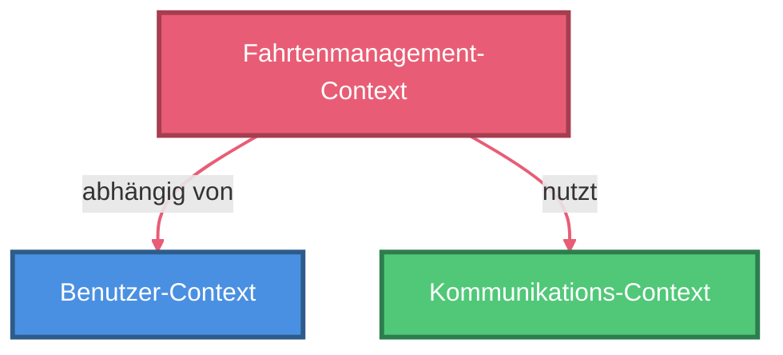

# Bounded Contexts & Context Map

> Stand: {{DATUM}}
> Projekt: {{PROJEKTNAME}}

---

## Übersicht

Bounded Contexts sind klar abgegrenzte Teilbereiche der Geschäftsdomäne, in denen jeweils ein eigenes, konsistentes Domain-Modell und eine spezifische Ubiquitous Language gelten. Sie bilden die Grundlage für eine modulare und skalierbare Architektur.

---

## Bounded Contexts

{{FÜR_JEDEN_BOUNDED_CONTEXT}}
### {{NUMMER}}. **{{CONTEXT_NAME}}**
- {{HAUPTVERANTWORTLICHKEIT_1}}
- {{HAUPTVERANTWORTLICHKEIT_2}}
- {{HAUPTVERANTWORTLICHKEIT_3}}
{{/FÜR_JEDEN_BOUNDED_CONTEXT}}

---

## Ubiquitous Language pro Context

Jeder Context verwendet eine eigene, präzise definierte Ubiquitous Language (siehe `ubiquitous-language_nomen&verben.md`). Begriffe wie {{BEISPIEL_BEGRIFF_1}}, {{BEISPIEL_BEGRIFF_2}}, {{BEISPIEL_BEGRIFF_3}} oder {{BEISPIEL_BEGRIFF_4}} können in verschiedenen Contexts unterschiedliche Bedeutungen und Attribute haben.

---

## Beziehungen zwischen Contexts

{{FÜR_JEDE_BEZIEHUNG}}
- **{{CONTEXT_NAME}}** {{BEZIEHUNGSBESCHREIBUNG}}
{{/FÜR_JEDE_BEZIEHUNG}}

---

## Context Map (Mermaid-Diagramm)

**Hinweis zur Farbgebung:**
Die Context Map verwendet unterschiedliche Farben für jeden Bounded Context, um die Übersichtlichkeit zu erhöhen. Die Farben sind so gewählt, dass sie auch beim Schwarz-Weiß-Ausdruck durch unterschiedliche Graustufen gut unterscheidbar sind. Die Pfeile haben jeweils die Farbe des Quell-Context, um die Abhängigkeitsrichtung visuell zu verdeutlichen.

**Empfohlene Farbpalette (druckfreundlich):**
- **Core Domain Contexts**: Kräftige Farben mit gutem Kontrast (z.B. #4A90E2 Blau, #E85D75 Rosa/Rot)
- **Supporting Subdomains**: Mittlere Sättigung (z.B. #50C878 Grün, #F4A460 Orange, #9B59B6 Lila)
- **Generic Subdomains**: Neutrale Farben (z.B. #7F8C8D Grau)
- **Administrative Contexts**: Signalfarben (z.B. #E74C3C Rot)

```mermaid
graph TD
  {{FÜR_JEDEN_CONTEXT}}
  {{CONTEXT_VARIABLE}}[{{CONTEXT_DISPLAY_NAME}}]
  {{/FÜR_JEDEN_CONTEXT}}

  %% Styling für Contexts - Farben die beim Ausdruck gut sichtbar sind
  {{FÜR_JEDEN_CONTEXT}}
  classDef {{CONTEXT_STYLE_NAME}} fill:{{FILL_COLOR}},stroke:{{STROKE_COLOR}},stroke-width:3px,color:#fff
  {{/FÜR_JEDEN_CONTEXT}}

  {{FÜR_JEDEN_CONTEXT}}
  class {{CONTEXT_VARIABLE}} {{CONTEXT_STYLE_NAME}}
  {{/FÜR_JEDEN_CONTEXT}}

  %% Verbindungen mit Labels (beschreiben die Art der Beziehung)
  {{FÜR_JEDE_VERBINDUNG}}
  {{QUELLE_CONTEXT}} -->|{{BEZIEHUNGS_LABEL}}| {{ZIEL_CONTEXT}}
  {{/FÜR_JEDE_VERBINDUNG}}

  %% Pfeile färben entsprechend dem Quell-Context
  {{FÜR_JEDE_VERBINDUNG}}
  linkStyle {{INDEX}} stroke:{{QUELLE_FARBE}},stroke-width:2px
  {{/FÜR_JEDE_VERBINDUNG}}
```

**Beispiel für konkrete Verwendung:**



**Legende zu Beziehungstypen:**
- **"abhängig von"**: Benötigt Daten oder Services vom Ziel-Context
- **"nutzt"**: Verwendet funktionale Services des Ziel-Context
- **"liefert Daten an"**: Stellt Daten für den Ziel-Context bereit
- **"benachrichtigt"**: Sendet Ereignisse/Nachrichten an den Ziel-Context
- **"verwaltet"**: Hat administrative Kontrolle über den Ziel-Context
- **"analysiert"**: Konsumiert Daten zur Analyse vom Ziel-Context
- **"basiert auf"**: Funktionalität baut auf Daten des Ziel-Context auf

---

## Anleitung für die Erstellung (für Chatmode)

**Schritt 1: Contexts identifizieren**
- Analysiere alle User Stories und die Domain-Kategorisierung
- Gruppiere zusammengehörige Funktionalitäten
- Definiere klare Grenzen und Verantwortlichkeiten

**Schritt 2: Farben zuweisen**
- **Core Domain**: Verwende kräftige, aufmerksamkeitsstarke Farben (Blau, Rot, Rosa)
- **Supporting Subdomains**: Verwende satte, aber weniger dominante Farben (Grün, Orange, Lila)
- **Generic Subdomains**: Verwende neutrale Farben (Grau, Beige)
- Stelle sicher, dass jede Farbe beim Ausdruck in Graustufen noch unterscheidbar ist
- Für die Stroke-Farbe: Verwende eine dunklere Variante der Fill-Farbe (ca. 30-40% dunkler)

**Schritt 3: Beziehungen definieren**
- Identifiziere Abhängigkeiten zwischen Contexts
- Verwende aussagekräftige Labels für die Art der Beziehung
- Färbe Pfeile in der Farbe des Quell-Context (von wo die Abhängigkeit ausgeht)

**Schritt 4: Mermaid-Diagramm erstellen**
- Deklariere alle Context-Nodes
- Definiere classDef für jeden Context mit fill, stroke und stroke-width
- Weise Classes zu (class X styleNameX)
- Definiere Verbindungen mit Labels
- Nummeriere und färbe die linkStyles entsprechend

**Schritt 5: Validierung**
- Prüfe, ob alle Contexts erfasst sind
- Stelle sicher, dass alle Beziehungen bidirektional dokumentiert sind (falls zutreffend)
- Überprüfe die Farbkontraste (auch für Ausdruck)
- Validiere, dass die linkStyle-Indizes korrekt sind (beginnen bei 0)

---

*Letzte Aktualisierung: {{DATUM}}*
