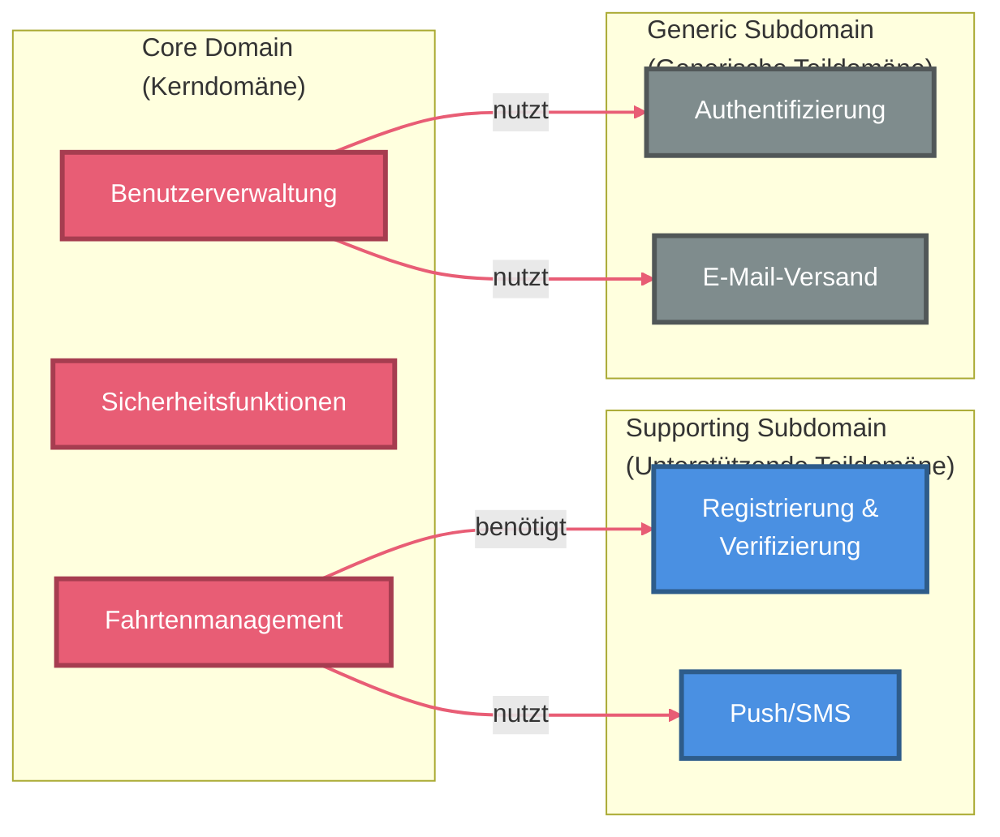

# Domänen-Kategorisierung

> Stand: {{DATUM}}
> Projekt: {{PROJEKTNAME}}

---

## Übersicht

Im strategischen Domain-Driven Design werden die Geschäftsdomäne und ihre Teilbereiche nach ihrer Bedeutung und Komplexität kategorisiert:

- **Core Domain (Kerndomäne)**
- **Supporting Subdomain (Unterstützende Teildomäne)**
- **Generic Subdomain (Generische Teildomäne)**

---

## Kategorisierung

### **Core Domain**
Das Herzstück der Plattform, hier entsteht der größte fachliche Mehrwert und Wettbewerbsvorteil.

{{FÜR_JEDE_CORE_DOMAIN_KOMPONENTE}}
- **{{KOMPONENTE_NAME}}**
  - {{HAUPTVERANTWORTLICHKEIT_1}}
  - {{HAUPTVERANTWORTLICHKEIT_2}}
  - {{HAUPTVERANTWORTLICHKEIT_3}}
{{/FÜR_JEDE_CORE_DOMAIN_KOMPONENTE}}

**Investitionsstrategie:**
- Höchste Priorität für Design, Entwicklung und Testing
- Fachliche Experten und Stakeholder eng einbinden
- Clean/Hexagonal Architecture empfohlen

---

### **Supporting Subdomains**
Wichtige, aber nicht differenzierende Funktionen, die die Core Domain unterstützen.

{{FÜR_JEDE_SUPPORTING_SUBDOMAIN}}
- **{{SUBDOMAIN_NAME}}**
  - {{BESCHREIBUNG}}
{{/FÜR_JEDE_SUPPORTING_SUBDOMAIN}}

**Investitionsstrategie:**
- Moderate Ressourcen, Standardlösungen bevorzugt
- Integration mit Core Domain sicherstellen

---

### **Generic Subdomains**
Standard-Probleme, die in vielen Anwendungen ähnlich gelöst werden und oft als fertige Komponenten verfügbar sind.

{{FÜR_JEDE_GENERIC_SUBDOMAIN}}
- **{{SUBDOMAIN_NAME}}**
  - {{BESCHREIBUNG}}
{{/FÜR_JEDE_GENERIC_SUBDOMAIN}}

**Investitionsstrategie:**
- Minimale Ressourcen, möglichst fertige Lösungen einsetzen
- Fokus auf Integration und Sicherheit

---

<div style="page-break-before: always;"></div>

## Visualisierung

**Hinweis zur Farbgebung:**
Die Visualisierung verwendet unterschiedliche Farben für jede Domain-Kategorie, die auch beim Ausdruck gut unterscheidbar sind:
- **Core Domain** (Rot-Töne): Höchste Priorität und Wettbewerbsvorteil
- **Supporting Subdomains** (Blau-Töne): Notwendige Unterstützung
- **Generic Subdomains** (Grau-Töne): Standard-Lösungen

Die Pfeile sind in der Farbe der Quell-Domain eingefärbt, um die Abhängigkeitsrichtung visuell zu verdeutlichen.

```mermaid
graph LR
  subgraph CoreDomain["Core Domain<br/>(Kerndomäne)"]
    direction TB
    {{FÜR_JEDE_CORE_DOMAIN_KOMPONENTE}}
    {{KOMPONENTE_VARIABLE}}[{{KOMPONENTE_DISPLAY_NAME}}]
    {{/FÜR_JEDE_CORE_DOMAIN_KOMPONENTE}}
  end
  
  subgraph SupportingDomain["Supporting Subdomain<br/>(Unterstützende Teildomäne)"]
    direction TB
    {{FÜR_JEDE_SUPPORTING_SUBDOMAIN}}
    {{SUBDOMAIN_VARIABLE}}[{{SUBDOMAIN_DISPLAY_NAME}}]
    {{/FÜR_JEDE_SUPPORTING_SUBDOMAIN}}
  end
  
  subgraph GenericDomain["Generic Subdomain<br/>(Generische Teildomäne)"]
    direction TB
    {{FÜR_JEDE_GENERIC_SUBDOMAIN}}
    {{SUBDOMAIN_VARIABLE}}[{{SUBDOMAIN_DISPLAY_NAME}}]
    {{/FÜR_JEDE_GENERIC_SUBDOMAIN}}
  end

  %% Styling für Core Domain - Rot-Töne (hohe Priorität)
  classDef coreStyle fill:#E85D75,stroke:#A63D50,stroke-width:3px,color:#fff
  
  %% Styling für Supporting Subdomain - Blau-Töne (mittlere Priorität)
  classDef supportingStyle fill:#4A90E2,stroke:#2E5C8A,stroke-width:3px,color:#fff
  
  %% Styling für Generic Subdomain - Grau-Töne (niedrige Priorität)
  classDef genericStyle fill:#7F8C8D,stroke:#515758,stroke-width:3px,color:#fff

  {{FÜR_JEDE_CORE_DOMAIN_KOMPONENTE}}
  class {{KOMPONENTE_VARIABLE}} coreStyle
  {{/FÜR_JEDE_CORE_DOMAIN_KOMPONENTE}}
  {{FÜR_JEDE_SUPPORTING_SUBDOMAIN}}
  class {{SUBDOMAIN_VARIABLE}} supportingStyle
  {{/FÜR_JEDE_SUPPORTING_SUBDOMAIN}}
  {{FÜR_JEDE_GENERIC_SUBDOMAIN}}
  class {{SUBDOMAIN_VARIABLE}} genericStyle
  {{/FÜR_JEDE_GENERIC_SUBDOMAIN}}

  %% Verbindungen von Core Domain zu Supporting Subdomain
  {{FÜR_JEDE_VERBINDUNG_CORE_TO_SUPPORTING}}
  {{QUELLE}} -->|{{BEZIEHUNGS_LABEL}}| {{ZIEL}}
  {{/FÜR_JEDE_VERBINDUNG_CORE_TO_SUPPORTING}}

  %% Verbindungen von Core Domain zu Generic Subdomain
  {{FÜR_JEDE_VERBINDUNG_CORE_TO_GENERIC}}
  {{QUELLE}} -->|{{BEZIEHUNGS_LABEL}}| {{ZIEL}}
  {{/FÜR_JEDE_VERBINDUNG_CORE_TO_GENERIC}}

  %% Pfeile in Core Domain Farbe (#E85D75)
  {{FÜR_JEDEN_PFEIL}}
  linkStyle {{INDEX}} stroke:#E85D75,stroke-width:2px
  {{/FÜR_JEDEN_PFEIL}}
```

**Beispiel für konkrete Verwendung:**



**Legende zu Beziehungstypen:**
- **"benötigt"**: Abhängigkeit für Kernfunktionalität
- **"nutzt"**: Verwendet Services der Ziel-Domain
- **"liefert Daten"**: Stellt Daten für die Ziel-Domain bereit
- **"triggert"**: Löst Prozesse in der Ziel-Domain aus

---

## Begründung

{{BEGRÜNDUNG_CORE_DOMAIN}}

{{BEGRÜNDUNG_SUPPORTING_SUBDOMAINS}}

{{BEGRÜNDUNG_GENERIC_SUBDOMAINS}}

---

## Anleitung für die Erstellung (für Chatmode)

### Schritt 1: User Stories und Story Map analysieren

**Quellen:**
- `docs/requirements/story-map.md` (Priorisierung: Must/Should/Could/Won't-Have)
- `docs/requirements/*.md` (User Stories)
- `docs/requirements/refined/*.md` (Verfeinerte User Stories)

**Für jede Funktionalität fragen:**
1. Ist dies ein **Wettbewerbsvorteil** unseres Produkts? → Core Domain
2. Ist dies **notwendig**, aber **branchenüblich**? → Supporting Subdomain
3. Ist dies ein **Standard-Problem** mit fertigen Lösungen? → Generic Subdomain

### Schritt 2: Core Domain identifizieren

**Die Core Domain ist:**
- Der **fachliche Kern** des Systems
- Das, was die Anwendung **einzigartig** macht
- Wo der größte **Business Value** entsteht
- Was sich am häufigsten **ändert**

**Typische Core Domains:**
- Geschäftslogik mit komplexen Regeln
- Algorithmen für Matching, Empfehlungen
- Domänenspezifische Workflows
- Innovatives Feature-Set

**Investition:** Höchste Priorität, eigene Entwicklung, saubere Architektur (Hexagonal/Clean)

### Schritt 3: Supporting Subdomains identifizieren

**Supporting Subdomains sind:**
- **Notwendig** für den Betrieb der Core Domain
- Aber **nicht differenzierend**
- Können mit **Standard-Lösungen** oder **geringem Aufwand** umgesetzt werden

**Typische Supporting Subdomains:**
- Registrierung & Onboarding (Standard-Flow)
- Benachrichtigungen (Push, SMS, E-Mail)
- Reporting & Statistiken
- Payment Processing (Integration)
- Belohnungssysteme

**Investition:** Moderate Ressourcen, Standardlösungen bevorzugt, einfachere Architektur (Layered)

### Schritt 4: Generic Subdomains identifizieren

**Generic Subdomains sind:**
- **Standard-Probleme**, die in vielen Anwendungen gleich sind
- Für die es **fertige, bewährte Lösungen** gibt
- Die **keinen fachlichen Mehrwert** bieten

**Typische Generic Subdomains:**
- Authentifizierung & Authorization (Auth0, Keycloak, SuperTokens)
- E-Mail-Versand (SendGrid, AWS SES, Mailgun)
- File Storage (AWS S3, Cloudinary, Azure Blob Storage)
- Logging & Monitoring (Sentry, DataDog, Elastic Stack)
- Geocoding (Google Maps API, OpenStreetMap Nominatim)
- Admin-Panel (AdminJS, React-Admin, Forest Admin)
- Audit-Log (Standard-Libraries)

**Investition:** Minimale Ressourcen, **Buy statt Build**, Integration über Adapter-Pattern

### Schritt 5: Visualisierung erstellen

**Diagramm-Aufbau:**
1. **Horizontale Anordnung** (`graph LR`)
   - Core Domain (links)
   - Supporting Subdomain (Mitte)
   - Generic Subdomain (rechts)

2. **Vertikale Komponenten** innerhalb jeder Kategorie (`direction TB`)

3. **Farbcodierung** (druckfreundlich):
   - Core: Rot-Töne (#E85D75, #A63D50)
   - Supporting: Blau-Töne (#4A90E2, #2E5C8A)
   - Generic: Grau-Töne (#7F8C8D, #515758)

4. **Abhängigkeiten** zeigen:
   - Pfeile von Core Domain zu Supporting/Generic
   - Alle Pfeile in Core Domain Farbe (#E85D75)
   - Labels: "benötigt", "nutzt", "liefert Daten", "triggert"

5. **Zeilenumbrüche** (`<br/>`) für lange Namen verwenden

### Schritt 6: Investitionsstrategien dokumentieren

**Für jede Kategorie:**
- **Core Domain:**
  - Höchste Priorität
  - Fachexperten einbinden
  - Clean/Hexagonal Architecture
  - Ausführliche Tests (Unit, Integration, E2E)
  - Continuous Refactoring

- **Supporting Subdomain:**
  - Moderate Priorität
  - Standardlösungen evaluieren
  - Layered Architecture ausreichend
  - Integration mit Core sicherstellen
  - Basis-Tests

- **Generic Subdomain:**
  - Niedrigste Priorität
  - **Buy statt Build**
  - Fertige SaaS/Libraries nutzen
  - Adapter-Pattern für lose Kopplung
  - Minimal-Tests (nur Integration)

### Schritt 7: Begründung dokumentieren

**Pro Kategorie erklären:**
- Warum gehört X zur Core Domain?
- Welche Supporting Subdomains sind notwendig?
- Welche fertigen Lösungen gibt es für Generic Subdomains?

**Beispiel:**
```
Die Core Domain umfasst [X, Y, Z], weil diese Funktionen den 
Wettbewerbsvorteil ausmachen und fachlich komplex sind.

Supporting Subdomains wie [A, B] sind notwendig für den Betrieb, 
aber branchenüblich.

Generic Subdomains wie [M, N] sind Standard-Probleme mit fertigen 
Lösungen (Auth0, SendGrid, etc.).
```

### Schritt 8: Validierung

**Checkliste:**
- [ ] Ist die Core Domain klar und fokussiert? (Nicht zu groß!)
- [ ] Sind Supporting Subdomains wirklich notwendig?
- [ ] Werden Generic Subdomains nicht selbst gebaut?
- [ ] Ist das Diagramm visuell klar und druckfreundlich?
- [ ] Sind alle Abhängigkeiten dokumentiert?
- [ ] Ist die Investitionsstrategie für jede Kategorie definiert?
- [ ] Ist die Begründung nachvollziehbar?

### Schritt 9: Mit Stakeholdern abstimmen

**Diskussionspunkte:**
- Ist die Core Domain aus Business-Sicht korrekt?
- Sind die Investitionsschwerpunkte richtig gesetzt?
- Gibt es Funktionen, die umkategorisiert werden sollten?

---

## Häufige Fehler vermeiden

### ❌ **Zu große Core Domain**
**Problem:** Alles wird als "wichtig" eingestuft → Core Domain wird zu groß

**Lösung:** 
- Fokus auf **Differenzierung**, nicht auf "Wichtigkeit"
- Frage: "Können wir das auch kaufen/integrieren?"
- Core Domain sollte **20-30%** des Systems ausmachen

### ❌ **Generic Subdomains selbst bauen**
**Problem:** "Wir bauen unsere eigene Auth/E-Mail/Admin-Lösung"

**Lösung:**
- **Buy statt Build** für Standard-Probleme
- Zeit und Budget in Core Domain investieren
- Fertige Lösungen sind oft besser, sicherer und günstiger

### ❌ **Supporting und Generic verwechseln**
**Problem:** Unklar, ob etwas Supporting oder Generic ist

**Lösung:**
- **Generic:** Es gibt fertige, bewährte Lösungen (Auth0, SendGrid, etc.)
- **Supporting:** Branchenüblich, aber projektspezifische Anpassung nötig

### ❌ **Keine klare Investitionsstrategie**
**Problem:** Alle Bereiche werden gleich behandelt

**Lösung:**
- Core: Maximale Ressourcen, beste Architektur
- Supporting: Moderate Ressourcen, pragmatische Lösung
- Generic: Minimale Ressourcen, fertige Lösung

---

*Letzte Aktualisierung: {{DATUM}}*
