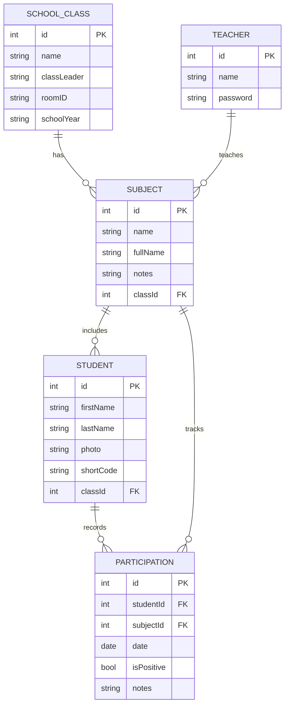

# Schüler-Mitarbeit-Tracker 📚

Eine Flutter-Anwendung zur schnellen und effizienten Erfassung der mündlichen Mitarbeit von Schülern im Unterricht.

## 📖 Übersicht

Der Schüler-Mitarbeit-Tracker wurde speziell für Lehrkräfte entwickelt, um die mündliche Beteiligung von Schülern während des Unterrichts einfach und diskret zu dokumentieren. Die App fokussiert sich auf eine schnelle Ein-Klick-Interaktion und bietet eine klare, datengestützte Grundlage für die Bewertung der Mitarbeit.

### Hauptziele

- ⚡ **Schnelle Erfassung**: Positive Mitarbeit mit einem Klick protokollieren
- 📊 **Datenbasierte Bewertung**: Objektive und nachvollziehbare Grundlage für die Notenvergabe
- 🔒 **Datenschutz**: Alle Daten werden ausschließlich lokal gespeichert
- 📁 **Einfacher Export**: CSV-Export für Weiterverarbeitung

## ✨ Features

### Kernfunktionen

- **Schnellerfassung positive Mitarbeit**: Ein-Klick auf einen Schüler erhöht dessen Zähler
- **Negative Verhaltensweisen**: Lang-Klick öffnet ein Menü mit vordefinierten negativen Aktionen
- **Schüler- und Klassenverwaltung**: 
  - Anlegen, Bearbeiten und Löschen von Klassen (Name, Klassenvorstand, Raumnummer, Schuljahr)
  - Verwaltung von Fächern pro Klasse (Kürzel, vollständiger Name, Anmerkungen)
  - Schülerverwaltung mit Namen, Foto und automatischem 3-stelligem Kürzel
- **Fächerverwaltung**: Zuordnung von Fächern zu Klassen
- **Konfigurierbare negative Aktionen**: Anpassbare Liste von negativen Verhaltensweisen
- **Datenauswertung**: Übersicht über positive und negative Einträge pro Schüler
- **CSV-Export**: Export der Daten einer Klasse mit Schülername, Datum, Typ und Details

### Datenschutz & Sicherheit

- ✅ **100% lokale Datenspeicherung** mit SQLite
- ✅ **Keine Cloud-Synchronisation**
- ✅ **Keine Weitergabe personenbezogener Daten**
- ✅ **Funktioniert vollständig offline**

## 🛠️ Technologie-Stack

### Framework & Sprache
- **Flutter** (SDK ^3.5.2)
- **Dart**

### Hauptabhängigkeiten

#### State Management
- `flutter_riverpod ^3.0.3` - Reaktives State Management
- `riverpod_annotation ^3.0.3` - Code-Generierung für Riverpod

#### Datenpersistenz
- `drift ^2.29.0` - Typsichere SQLite-Datenbank für Dart/Flutter
- `sqlite3_flutter_libs ^0.5.40` - SQLite-Bibliotheken für Flutter
- `path_provider ^2.1.5` - Zugriff auf Dateisystempfade

#### UI & UX
- `google_fonts ^6.3.0` - Schöne Schriftarten
- `cupertino_icons ^1.0.8` - iOS-Style Icons
- `image_picker ^1.1.2` - Auswahl/Aufnahme von Schülerfotos

#### Export & Sharing
- `csv ^6.0.0` - CSV-Datei-Generierung
- `share_plus ^12.0.1` - Teilen von Dateien

#### Utilities
- `intl ^0.20.2` - Internationalisierung und Datumsformatierung
- `permission_handler ^12.0.1` - Verwaltung von App-Berechtigungen

### Dev Dependencies
- `flutter_lints ^6.0.0` - Code-Qualität und Best Practices
- `drift_dev ^2.29.0` - Code-Generierung für Drift
- `build_runner ^2.4.13` - Build-Tool
- `riverpod_generator ^3.0.3` - Code-Generierung für Riverpod
- `riverpod_lint ^3.0.3` - Linting für Riverpod

## 📊 Datenmodell



## 🚀 Installation & Setup

### Voraussetzungen

- Flutter SDK (^3.5.2)
- Dart SDK
- Android Studio / VS Code mit Flutter-Plugin
- Ein Android/iOS-Gerät oder Emulator

### Installation

1. Repository klonen oder herunterladen

2. Dependencies installieren:
```bash
flutter pub get
```

3. Code-Generierung ausführen:
```bash
flutter pub run build_runner build --delete-conflicting-outputs
```

4. App starten:
```bash
flutter run
```

## 📱 Verwendung

### Erster Start

1. Beim ersten Start eine Klasse anlegen
2. Schüler zur Klasse hinzufügen
3. Optional Fächer konfigurieren
4. Optional negative Verhaltensweisen anpassen

### Während des Unterrichts

1. **Positive Mitarbeit erfassen**: Kurzer Klick auf einen Schüler
2. **Negative Aktion erfassen**: Langer Klick → Aktion aus dem Menü wählen
3. Visuelles Feedback bestätigt die Erfassung

### Auswertung

1. Detailansicht pro Schüler aufrufen
2. Übersicht über positive/negative Einträge einsehen
3. Bei Bedarf Daten als CSV exportieren

## 📄 Export-Format

Die CSV-Exportdatei enthält folgende Spalten:
- Schülername
- Datum
- Typ (Positiv/Negativ)
- Details (bei negativen Einträgen)
- Klasse
- Fach

## 🎯 Erfolgsmetriken

- **⏱️ Erfassungszeit**: < 2 Sekunden pro Interaktion
- **🖱️ Export**: < 5 Klicks für CSV-Export
- **📱 Performance**: Schnelle App-Startzeit, auch bei 500+ Schülern
- **🔋 Ressourcen**: Minimale Akku-Belastung

## 🗺️ Roadmap

### Phase 1: MVP ✅
- Grundlegende Schüler- und Klassenverwaltung
- Ein-Klick-Erfassung für positive Mitarbeit

### Phase 2: Kernfunktionen 🚧
- Lang-Klick-Funktion für negative Mitarbeit
- Konfigurationsbildschirm für negative Aktionen

### Phase 3: Auswertung & Abschluss 📋
- Datenübersicht
- CSV-Export
- Testing & Bugfixing

## 🤝 Beitragen

Dies ist ein privates Projekt. Bei Fragen oder Anregungen bitte ein Issue erstellen.

## 📝 Lizenz

Dieses Projekt ist für den privaten/schulischen Gebrauch bestimmt.

---

**Version**: 1.0.0+1  
**Entwickelt mit** ❤️ **und Flutter**
