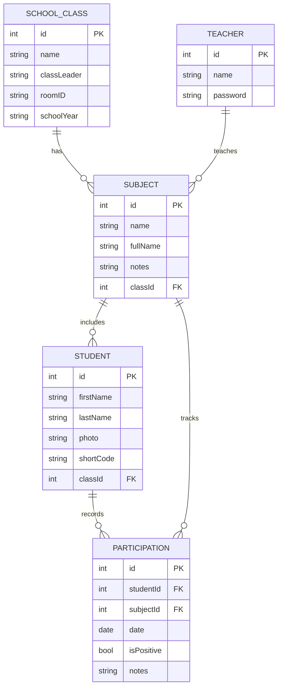

# PRD: Schüler-Mitarbeit-Tracker

## 1. Product overview

### 1.1 Document title and version

*   PRD: Schüler-Mitarbeit-Tracker
*   Version: 1.0

### 1.2 Product summary

Dieses Projekt ist eine Flutter-Anwendung, die für Lehrkräfte entwickelt wurde, um die mündliche Mitarbeit von Schülern im Unterricht einfach und effizient zu erfassen. Die App konzentriert sich auf eine schnelle Ein-Klick-Interaktion zur Protokollierung positiver Beiträge und bietet eine separate Option zur Erfassung negativer Verhaltensweisen.

Ziel ist es, den manuellen Aufwand bei der Notizführung zu reduzieren, eine datengestützte Grundlage für die Bewertung der Mitarbeit zu schaffen und einen klaren Überblick über die Beteiligung jedes Schülers zu geben. Alle Daten werden lokal auf dem Gerät des Nutzers gespeichert, um den Datenschutz zu gewährleisten. Ein einfacher Datenexport im CSV-Format ermöglicht die Weiterverarbeitung der erfassten Informationen.

## 2. Goals

### 2.1 Business goals

*   Reduzierung des Zeitaufwands für die administrative Erfassung der Schülermitarbeit.
*   Schaffung einer objektiven und nachvollziehbaren Datengrundlage für die Notenvergabe.
*   Steigerung der Effizienz im Unterrichtsalltag durch ein fokussiertes und schnelles Werkzeug.

### 2.2 User goals

*   Ich möchte mit einem einzigen Klick eine positive Mitarbeit eines Schülers festhalten.
*   Ich möchte vordefinierte negative Verhaltensweisen schnell und unkompliziert protokollieren.
*   Ich möchte eine einfache Übersicht über die Mitarbeit jedes Schülers erhalten.
*   Ich möchte die erfassten Daten zur weiteren Analyse oder für die Notengebung als CSV-Datei exportieren können.

### 2.3 Non-goals

*   Die App ist kein vollwertiges Schulverwaltungssystem.
*   Es gibt keinen Zugang für Schüler oder Eltern.
*   Komplexe Kurs- oder Stundenplan-Management-Funktionen sind nicht vorgesehen.
*   Eine Synchronisierung zwischen mehreren Geräten ist vorerst nicht geplant.

## 3. User personas

### 3.1 Key user types

*   Lehrkraft

### 3.2 Basic persona details

*   **Lehrkraft**: Eine Lehrperson, die eine oder mehrere Klassen unterrichtet und eine schnelle, unauffällige Methode benötigt, um die mündliche Beteiligung während des Unterrichts zu dokumentieren.

### 3.3 Role-based access

*   **Administrator**: Der einzige Nutzer der App (die Lehrkraft) hat vollen Zugriff auf alle Funktionen, von der Dateneingabe bis zum Export.

## 4. Functional requirements

*   **Schüler- und Klassenverwaltung** (Priority: High)
    *   Anlegen, Bearbeiten und Löschen von Klassen (Name, Klassenvorstand, Raumnummer, Schuljahr).
    *   Anlegen, Bearbeiten und Löschen von Fächern (Kürzel, optionaler vollständiger Name, optionale Anmerkungen) pro Klasse.
    *   Anlegen, Bearbeiten und Löschen von Schülern (Name, Foto) innerhalb einer Klasse.
    *   Für jeden Schüler wird ein 3-stelliges Kürzel (default: erste 3 Buchstaben des Nachnamens in Grossbuchstaben) gespeichert, das bei Bedarf manuell geändert werden kann.
*   **Mitarbeit-Tracking** (Priority: High)
    *   Ein einfacher Klick auf einen Schüler inkrementiert dessen Zähler für positive Mitarbeit.
    *   Ein langer Klick auf einen Schüler öffnet ein Menü mit negativen Verhaltensweisen.
    *   Die Auswahl einer negativen Verhaltensweise protokolliert diesen Vorfall für den Schüler.
*   **Konfiguration** (Priority: Medium)
    *   Der Nutzer kann die Liste der negativen Verhaltensweisen selbst definieren und verwalten.
*   **Auswertung & Export** (Priority: High)
    *   Eine einfache Ansicht zeigt die gesammelten Daten pro Schüler (Anzahl positiver und negativer Einträge).
    *   Export der Daten einer Klasse als CSV-Datei.

## 5. User experience

### 5.1 Entry points & first-time user flow

*   Beim ersten Start wird der Nutzer aufgefordert, eine erste Klasse und Schüler anzulegen.
*   Der Hauptbildschirm zeigt die Schülerliste der zuletzt ausgewählten Klasse an.

### 5.2 Core experience

*   **Schnellerfassung**: Die Hauptansicht ist eine Liste oder ein Gitter von Schülern (mit Foto oder 3-stelligem Kürzel und Namen), um eine schnelle Auswahl per Klick zu ermöglichen. Dies stellt sicher, dass die Erfassung den Unterrichtsfluss minimal stört.
*   **Klare Trennung**: Positive (Ein-Klick) und negative (Lang-Klick) Interaktionen sind klar getrennt, um Fehlbedienungen zu vermeiden.

### 5.3 Advanced features & edge cases

*   Was passiert, wenn ein Schüler die Klasse wechselt? Es sollte eine Funktion geben, um Schüler einer anderen Klasse zuzuordnen.
*   Die App muss auch ohne Netzwerkverbindung voll funktionsfähig sein.

### 5.4 UI/UX highlights

*   Visuelles Feedback nach einer erfolgreichen Erfassung (z.B. eine kurze Animation).
*   Übersichtliche Darstellung der Schüler mit grossen, leicht antippbaren Flächen.

## 6. Narrative

Eine Lehrkraft startet die App zu Beginn der Stunde. Auf dem Bildschirm erscheint sofort die Schülerliste der aktuellen Klasse. Während des Unterrichts tippt die Lehrkraft kurz auf das Bild eines Schülers, der einen wertvollen Beitrag leistet. Später stört ein anderer Schüler den Unterricht; die Lehrkraft drückt lange auf dessen Namen, wählt "Stört den Unterricht" aus einer Liste und hat den Vorfall damit dokumentiert. Am Ende des Quartals exportiert sie die gesammelten Daten mit wenigen Klicks als CSV-Datei, um die Mitarbeitsnoten fair und transparent zu ermitteln.

## 7. Success metrics

### 7.1 User-centric metrics

*   Zeit für die Erfassung einer einzelnen Interaktion (Ziel: < 2 Sekunden).
*   Anzahl der Klicks, die für den CSV-Export benötigt werden (Ziel: < 5 Klicks).
*   Hohe Zufriedenheit des Nutzers bei der Verwaltung und Übersichtlichkeit der Daten.

### 7.2 Business metrics

*   (Nicht anwendbar für ein persönliches Projekt, aber der Erfolg zeigt sich in der täglichen Nutzung und Zeitersparnis).

### 7.3 Technical metrics

*   Schnelle App-Startzeit.
*   Zuverlässige und verlustfreie Datenspeicherung auf dem Gerät.
*   Minimale Akku-Belastung während der Nutzung.

## 8. Technical considerations

### 8.1 Integration points

*   Zugriff auf die Kamera und Fotogalerie des Geräts zum Hinzufügen von Schülerfotos.
*   Zugriff auf das Dateisystem zum Speichern der exportierten CSV-Datei.

### 8.2 Data storage & privacy

*   Alle Daten (Schülernamen, Fotos, Leistungsdaten) werden ausschliesslich lokal auf dem Gerät in einer SQLite-Datenbank gespeichert.
*   Es findet keine Übertragung von personenbezogenen Daten an externe Server statt.

### 8.3 Scalability & performance

*   Die App muss auch bei einer grossen Anzahl von Schülern (z.B. 500+) und Einträgen performant bleiben.
*   Die Benutzeroberfläche muss flüssig und reaktionsschnell sein.

### 8.4 Potential challenges

*   Gewährleistung der Datensicherheit und einfacher Backup-Möglichkeiten für den Nutzer (z.B. durch Export/Import der gesamten Datenbank).
*   Eine intuitive Benutzeroberfläche für die Konfiguration der negativen Aktionen zu gestalten.

## 9. Milestones & sequencing

### 9.1 Project estimate

*   Mittel: 2-4 Wochen

### 9.2 Team size & composition

*   1 Entwickler

### 9.3 Suggested phases

*   **Phase 1: MVP** (1 Woche)
    *   Grundlegende Schüler- und Klassenverwaltung.
    *   Implementierung der Ein-Klick-Erfassung für positive Mitarbeit.
*   **Phase 2: Kernfunktionen** (1-2 Wochen)
    *   Implementierung der Lang-Klick-Funktion für negative Mitarbeit.
    *   Erstellung des Konfigurationsbildschirms für negative Aktionen.
*   **Phase 3: Auswertung & Abschluss** (1 Woche)
    *   Entwicklung der Datenübersicht.
    *   Implementierung des CSV-Exports.
    *   Testing und Bugfixing.

## 10. User stories

### 10.1 Schüler verwalten

*   **ID**: GH-001
*   **Description**: Als Lehrkraft möchte ich Schüler mit Namen, Klasse, Fach und optional einem Foto anlegen, damit ich sie im System erfassen kann. Für jeden Schüler soll automatisch ein änderbares, 3-stelliges Kürzel generiert werden.
*   **Acceptance criteria**:
    *   Ich kann einen neuen Schüler erstellen.
    *   Beim Erstellen muss ich einen Namen und eine Klasse/Fach angeben.
    *   Ein 3-stelliges Kürzel (erste 3 Buchstaben des Nachnamens, grossgeschrieben) wird automatisch generiert.
    *   Ich kann das Kürzel manuell anpassen.
    *   Ich kann optional ein Foto vom Gerät hinzufügen.
    *   Der erstellte Schüler erscheint in der Liste seiner Klasse.

### 10.2 Positive Mitarbeit erfassen

*   **ID**: GH-002
*   **Description**: Als Lehrkraft möchte ich durch einen einzigen, schnellen Klick auf einen Schüler dessen positive Mitarbeit protokollieren.
*   **Acceptance criteria**:
    *   Auf dem Hauptbildschirm sehe ich eine Liste meiner Schüler.
    *   Ein Klick auf einen Schüler erhöht dessen Zähler für positive Mitarbeit um eins.
    *   Ich erhalte ein kurzes visuelles Feedback, dass die Aktion erfolgreich war.

### 10.3 Negative Mitarbeit erfassen

*   **ID**: GH-003
*   **Description**: Als Lehrkraft möchte ich durch einen langen Klick auf einen Schüler eine Liste von negativen Verhaltensweisen sehen und eine davon auswählen.
*   **Acceptance criteria**:
    *   Ein langer Klick auf einen Schüler öffnet ein Kontextmenü oder einen Dialog.
    *   Das Menü zeigt eine Liste von vordefinierten negativen Aktionen an.
    *   Die Auswahl einer Aktion protokolliert diesen Vorfall für den Schüler.

### 10.4 Negative Aktionen konfigurieren

*   **ID**: GH-004
*   **Description**: Als Lehrkraft möchte ich die Liste der negativen Verhaltensweisen selbst bearbeiten, hinzufügen oder löschen können.
*   **Acceptance criteria**:
    *   Es gibt einen Einstellungsbereich in der App.
    *   In den Einstellungen kann ich die Liste der negativen Aktionen einsehen.
    *   Ich kann neue Aktionen zur Liste hinzufügen.
    *   Ich kann bestehende Aktionen aus der Liste entfernen.

### 10.5 Daten auswerten und exportieren

*   **ID**: GH-005
*   **Description**: Als Lehrkraft möchte ich eine einfache Übersicht über die Mitarbeit jedes Schülers sehen und diese Daten als CSV-Datei exportieren.
*   **Acceptance criteria**:
    *   Es gibt eine Detailansicht pro Schüler, die die Anzahl der positiven und negativen Einträge anzeigt.
    *   Es gibt eine Export-Funktion für eine ganze Klasse.
    *   Die exportierte CSV-Datei enthält mindestens die Spalten: `Schülername`, `Datum`, `Typ (Positiv/Negativ)`, `Details (bei Negativ)`.

### 10.6 Datensicherheit gewährleisten

*   **ID**: GH-006
*   **Description**: Als Lehrkraft möchte ich sicher sein, dass alle sensiblen Schülerdaten nur auf meinem Gerät gespeichert werden.
*   **Acceptance criteria**:
    *   Die App fordert keine Netzwerkberechtigungen an, die für die Kernfunktion nicht notwendig sind.
    *   Alle Daten werden in einer lokalen Datenbank auf dem Gerät gespeichert.
    *   Es werden keine Daten ohne meine explizite Aktion (z.B. Export) an andere Apps oder Dienste weitergegeben.

#### Entity-Relationship-Modell (Mermaid)

